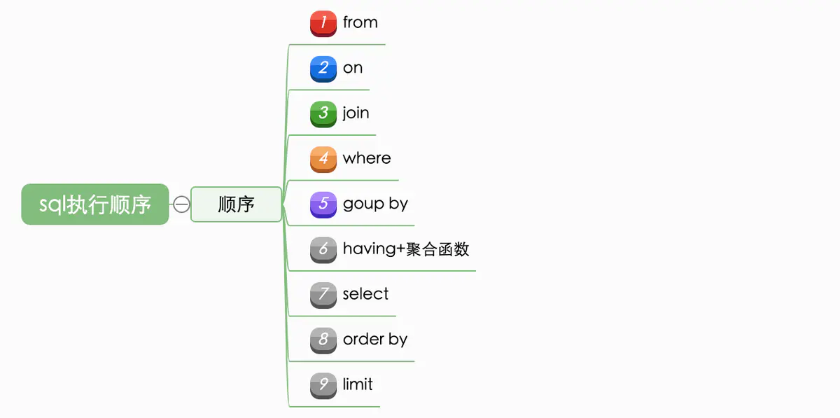
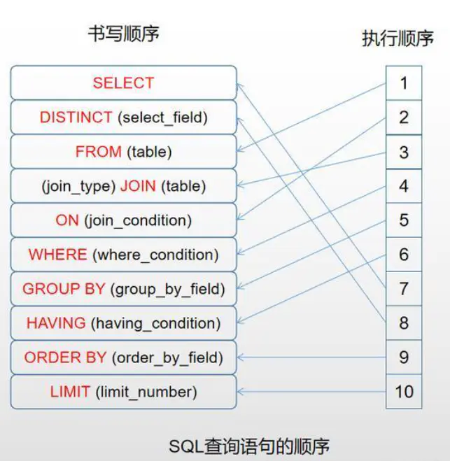

# SQL学习

### 一. 重点总结
1. 子查询
2. 联结(join)：内联结、自联结、左外联结、右外联结。
3. 视图
4. 存储过程与游标
5. 触发器与定时任务
6. 事务管理
7. 索引
8. 系统表/日志/性能分析

### 二. 案例
查询msg表中这些行：对某个no，对应type至少存在三个值TX，RX，TR

```
mysql> select * from msg;
+----+----+------+
| id | no | type |
+----+----+------+
|  1 | A  | TX   |
|  2 | A  | RX   |
|  3 | A  | TR   |
|  4 | A  | OX   |
|  5 | B  | TX   |
|  6 | B  | C    |
|  7 | B  | RX   |
|  8 | B  | XX   |
|  9 | C  | TX   |
| 10 | B  | TR   |
| 11 | C  | RX   |
+----+----+------+
11 rows in set (0.00 sec)

mysql> SELECT * FROM msg WHERE type REGEXP 'TX|RX|TR' AND (SELECT COUNT(DISTINCT t.type) FROM msg as t WHERE t.type REGEXP 'TX|RX|TR' AND t.`no` = msg.`no`) =3;
+----+----+------+
| id | no | type |
+----+----+------+
|  1 | A  | TX   |
|  2 | A  | RX   |
|  3 | A  | TR   |
|  5 | B  | TX   |
|  7 | B  | RX   |
| 10 | B  | TR   |
+----+----+------+
6 rows in set (0.00 sec)
```
### 三. MySQL执行过程及执行顺序



针对MySQL，其条件执行顺序是 从左往右，自上而下。

针对Orcale，其条件执行顺序是从右往左，自下而上。

[参考链接](https://www.jianshu.com/p/ff8bc0ec6365)

