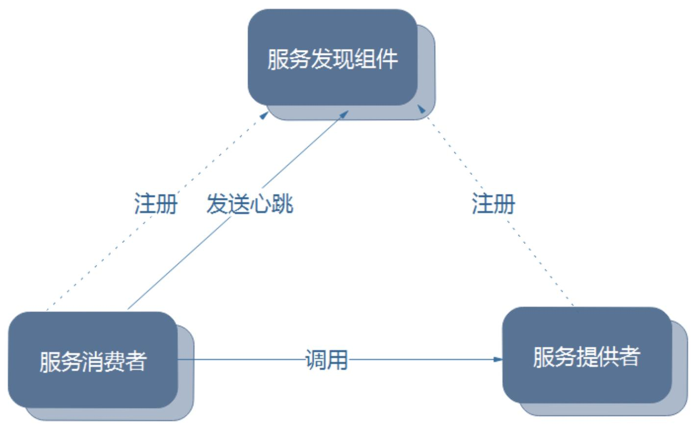
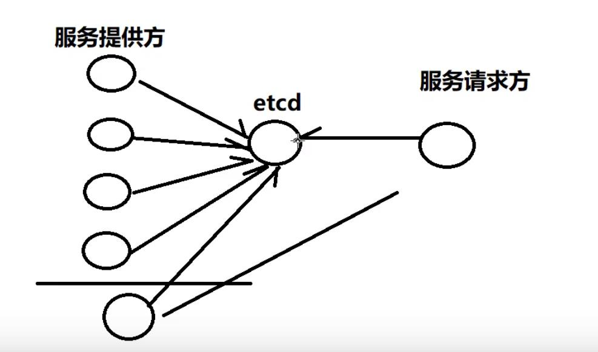

# etcd与分布式与微服务

常用服务分类及其分布式架构设计：
1. web静态服务
2. http接口服务
3. 数据库服务
5. 文件服务器
4. 中间件服务：
    - 服务注册与发现服务
    - 缓存服务
    - MQ服务
    - 消息推送服务
2. IM即时通讯服务
3. 流媒体服务器
    - 直播服务器
    - 视频会议服务器
    
### 分布式知识：
    - 消息队列
    - rpc
    - 网关：nginx
    - 分布式文件：oss
    - 分布式存储：mysql，redis
    - 分布式锁：etcd
    - 服务注册与发现：etcd

### 集群自动扩展方法：
1. nginx的负载均衡 + 阿里云的负载均衡
3. MQ消息队列
5. 服务注册与发现：etcd
4. 自建以上三种。

简单聊聊服务发现（redis,zk,etcd,consul）https://www.cnblogs.com/sunsky303/p/11126400.html

etcd：`高可用、强一致性的小型kv数据存储服务。`

etcd作用：**共享配置，服务发现，集群监控，leader选举，分布式锁等场景。**

