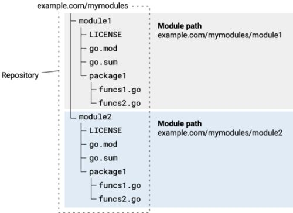

# golang开发记录

### 基本知识
1. 新版不在需要手动配置GOPATH, 默认在用户目录下。
2. 采用mod管理项目。依赖库默认下载到GOPATH的pkg目录。
3. go env -w GOPROXY=https://goproxy.cn,direct

### 仓库-模块-目录/包-文件-变量-函数

1. 模块是 go 包的集合。
2. 包是 .go 文件的目录。
    - 一列go文件的集合。
    - 一个文件夹下只能有一个package。
    - 不同文件夹package不能有重复。
    - 习惯将包名和目录名保证一致，但这不是强制规定。
3. import
    - import 导入的参数是路径，而非包名
    - 在代码中引用包成员时，使用包名而非目录名；

### 项目管理（模块管理）
```
go mod init github.com/xiaozhu/hello     // 指定名称，创建 module
go get                                   // 安装缺少的依赖
go get "xxx@v1.0.0"                      // 指定版本安装依赖
go build [单go文件 | go文件列表 | 目录 | 包名]

go mode tidy                                  // 安装缺少的依赖，清理无用的依赖

go list -m all 打印当前模块的依赖项。
go list -m -versions 模块名（查看某模块的所有版本）
go test

import "github.com/xiaozhu/hello"        // 使用
```

### 关于context
https://blog.csdn.net/weixin_45994575/article/details/123314937