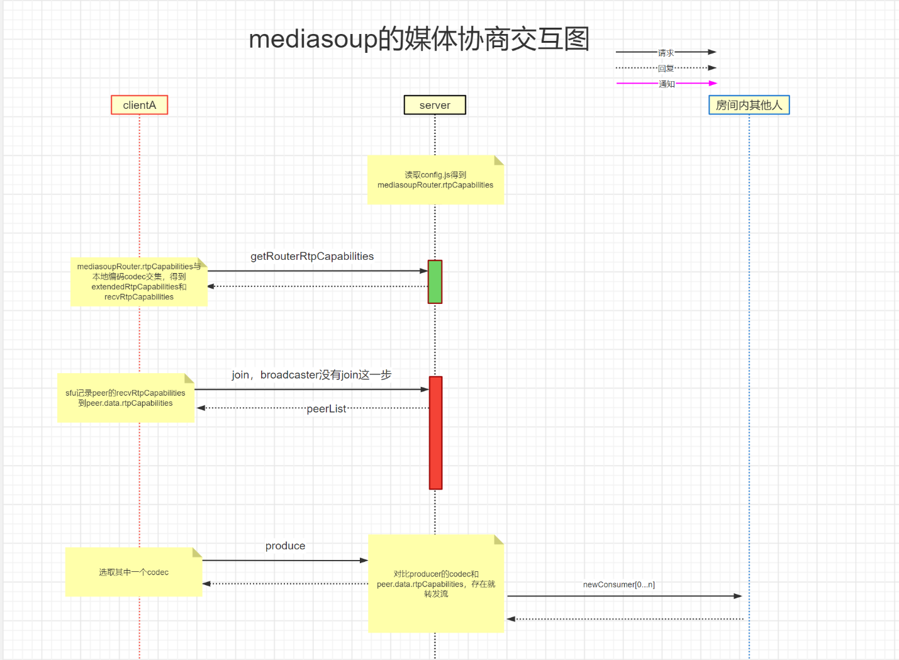

# mediasoup媒体控制与协商机制

### 1.本文要探究的问题，这是迈向应用的重要一步：
- 怎么控制分辨率、码率、帧率、采样率、声道数，起始码率，最小码率，最大码率？
    - 分辨率由videoSource控制，webrtc通过wants参数设定需要。
    - 视频码率在Produce时的encodings参数控制。
    - 音频参数TODO
- 怎么控制视频编码格式？
    - 以sfu配置的编码优先级为准。
    - Produce的codec参数,3.3.4支持
- 怎么控制simucast的层数，每一层的参数？
    - Produce的encodings，每一个encoding就是一个simulcast。
- 怎么控制svc的参数？
    - Produce的encodings的scalabilityMode参数,还有scale_resolution_down_by，浏览器用的scaleResolutionDownBy
- 怎么通过信令选择特定的simucast层与svc层？
    - 通过consumer.setPreferredLayers()选择空间/时间层。
    - 根据带宽估计自动切layer。
- 怎么控制rtp扩展头与rtcp参数？
    - 看后续的mediasoup的sdp协商过程

### 2. 读官方文档（非常重要）:[RTP Parameters and Capabilities](https://mediasoup.org/documentation/v3/mediasoup/rtp-parameters-and-capabilities/#RTP-Negotiation-Overview)
1. mediasoup不在使用sdp，而是用两个重要的概念控制参数：RtpParameters和 RtpCapabilities
    - RtpParameters:描述客户端发送或者接受媒体信息。推流端RtpSendParameters，拉流端RtpReceiveParameters。
        - String mid
        - Array<RtpCodecParameters> codecs
            - Object parameters  //某个编码内部参数
            - Array<RtcpFeedback> rtcpFeedback
        - Array<RtpHeaderExtensionParameters> headerExtensions
        - Array<RtpEncodingParameters> encodings。//是一个列表，每一个就是一层的simulcast。详见[官方文档](https://mediasoup.org/documentation/v3/mediasoup/rtp-parameters-and-capabilities/#Simulcast)
            - String scalabilityMode //定义svc，详见[官方文档](https://mediasoup.org/documentation/v3/mediasoup/rtp-parameters-and-capabilities/#SVC)
        - RtcpParameters rtcp
    - RtpCapabilities：描述服务端或者客户端接收媒体的能力。 所以RtpParameters不能乱填，要符合对方的RtpCodecCapability。
        - Array<RtpCodecCapability> codecs
        - Array<RtpHeaderExtension> headerExtension
2. mediasoup的RTP协商[官方说明](https://mediasoup.org/documentation/v3/mediasoup/rtp-parameters-and-capabilities/#RTP-Negotiation-Overview)
    - 发送 RTP 的实体（mediasoup 或端点）决定发送 ID。
    - 接收 RTP 的实体（mediasoup 或端点）必须遵守这些 id。

### 3. 读代码看流程
3. rtp控制流程（非常重要，应该画一个交互图）
    - 服务端启动时确定sfu-RtpCapabilities：读取config.js的mediasoup.routerOptions.mediaCodecs指定了支持的所有编码格式。
    - 客户端1：通过信令拿到服务端支持的sfu-RtpCapabilities。
    - 客户端2：Device->Load(sfu-RtpCapabilities)：取交集（本地支持的rtp参数和服务端的rtp参数）。得到：
        - extendedRtpCapabilities
        - recvRtpCapabilities
    - 客户端3：创建SendTransport和RecvTransport。传入extendedRtpCapabilities。
        - Transport的成员Handler选择第一个codec计算出sendingRtpParametersByKind和sendingRemoteRtpParametersByKind
    - 客户端4：join到sfu，sfu记录recvRtpCapabilities。
    - 客户端5：send_transport_->Produce(encodings,...codec)，计算出：
        - sendingRtpParameters：选取第一个codec，或者根据参数选择。发送给sfu记录下来。
        - sendingRemoteRtpParameters：用于本地设置到pc。
    - 服务端：发现有有人推流，遍历其他人：如果join时记录的rtp与produce的rtp匹配就推给他。
### 4.其他
1.  mediasoup优点：
    - 流控方便：暂停，恢复，打开，关闭 很容易。
    - 干掉与sfu的sdp传输与协商：实现了自己的一套简单RtpParameters传递与协商。
    - 参数控制变动容易：分辨率、码率、帧率、采样率、声道数，起始码率，最小码率，最大码率，codec，simulcast，svc。
    - 非常重要：支持基于simulcast/svc的多路流，实现拉流端码率切换。
2. webrtc内建的编解码器测试
    - VP8：支持simulcast, 支持SVC
    - VP9： server报错不支持simulcast, 支持SVC且必须至少两层
    - H264：支持simulcast, 支持SVC
3. 参考资料
    - 初始分辨率直接peerconnection例程里面建立track就有设置，
    - 码率主要是peerconnection有setbitrate接口设置初始码率，最小和最大码率，中间是撒码率，算法会自动调，当然也可以自己修改。
    - 然后中间自动变化的帧率是根据拥塞窗口长度设置，还要看有无太多滞留未编码帧。
    - 那就吧流有个参数设置成kfluid，这个就不会调分辨率了。

