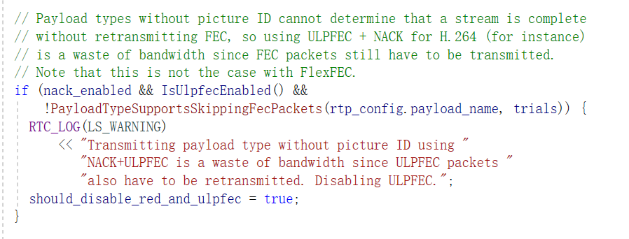

# WebRTC的nack，red，fec

### 一. nack/red/fec的支持情况和默认开启
>默认抗丢包方案：音频靠opus的带内fec，视频靠nack重传。

类型 | nack | red | fec | mediasoup-fec
---|---|---|---|---
音频 | 支持，默认**不开启** | 支持，默认**不开启**|只支持opus的带内fec，只有opus默认开启|支持
视频 | 支持，默认开启 | 支持，只有h264默认开启| 支持，只有h264默认开启ulpfec|不支持，因消耗cpu

分析一下原因：
1. 为什么视频只用nack+默认不都开启red和fec？
    - red就是重复发包，而ulpfec只是red套壳且没法跟nack并存。
    - 视频数据量大，red和ulpfec直接重复发包，**成本太大不值得**。
    - flexfec：web端google没集成，只能native。
2. 为什么音频默认不开启nack和red？
    - 音频码率占比小，当音频需要red和nack拯救时，视频基本已没法看了。
    - 音频nack和red它适合纯音频场景。
3. tx是怎么做到抗50%丢包？
    - 分析来看nack+flexfec可能做不到，具体方法未知
 
总结：
- 音频靠opus的带内fec + 视频靠nack重传：这是最低成本的方案同时也是最有效的方案。
- 还想提升一下：就把音频的nack/red打开，native视频的flexfec打开。
- 继续提升：音频red包N次，视频red包N次，[参考：丢包率和重复发包次数的关系](丢包率和重复发包次数的关系.md)

### 二. 简单总结 
- opus的带内fec是codec自带的，就是原始音频包。opus带内fec增加很少带宽。
- 视频默认只开nack ，抗不了20%丢包。
- flexfec开启可以nack的，ulpfec开启不能nack。 
- flexfec是单独的ssrc，ulpfec不是。
- 视频nack重传有两种一种是普通重传，一种是rtx重传。后者独立ssrc。音频重传只是普通重传。
- 视频red和原始媒体同一个ssrc，rtx和fec独立ssrc。
- mediasoup基于packet, 比基于frame的实现fec要困难
 
### 三. 音频开启red抗丢包
- webrtc M88甚至更早就支持opus red，M99已经默认开启，但协商不成功则不启用。
- red相当于成本翻倍，但音频流量占比少，所以音频加上red能提高音频质量而不用占用很多带宽完全值得。
- red虽然增加了流量，但是他不增加udp数据包个数，这个很重要，在一定程度可以避免网络拥塞的恶化
- sfu如果拉流端有的支持、有的不支持red，sfu不能透传会比较麻烦。

### 四.经验
- 冗余度(指抗丢包的冗余带宽占比)=丢包率的时候性价比最高。
- webrtc无法识别丢包是拥塞导致的还是物理链路原因，就会预测降带宽，导致预测结果上不去而不发送足够fec和red，可以强行发送。
- 大厂抗大丢包率(百分之几十)靠fec
- 理论上来说，在不拥塞的情况下，大厂的做法是尽量提高带宽利用率
- fec+nack ，基本能抗70%
- webrtc准备把pcc加到拥塞控制中
- opus音频：延时小时，用带内fec+nack ；延时大时，用带内fec+red
- 抗突发丢包：可以预发一些fec包处理，nack的话会引入时延

### 五.问题
- fec耗cpu还没太大用？暂时只考虑red, 不考虑video fec？
- red的成本太高，流量翻倍？
- nack+fec+red是不是更加冗余？
- 如果启用FlexFec，那丢包重传是用原有的单独的rtx包还是用FlexFec 本身带的重传功能？
- h264 flexfec和nack可以并存的。那个是指flexfec自己不增加nack这个fmtp。对于red ulpfec则全部rtcp feedback都不加
- 提到一个开源项目Jitsi Meet：https://jitsi.org/jitsi-meet/