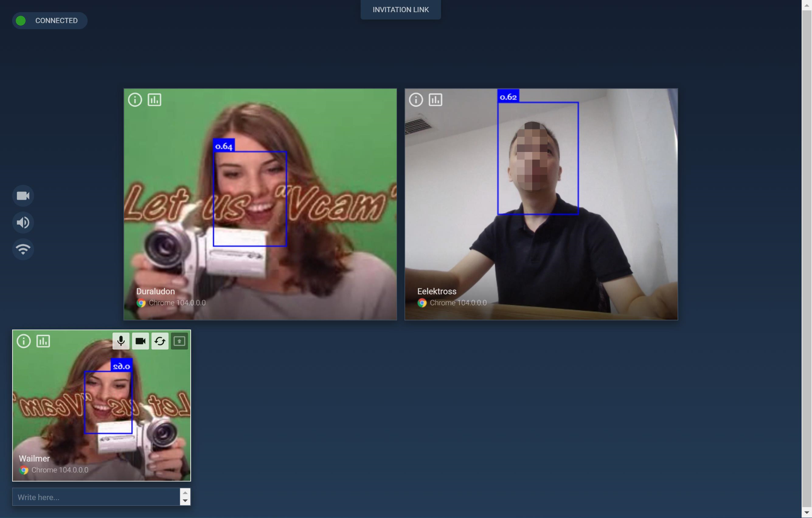
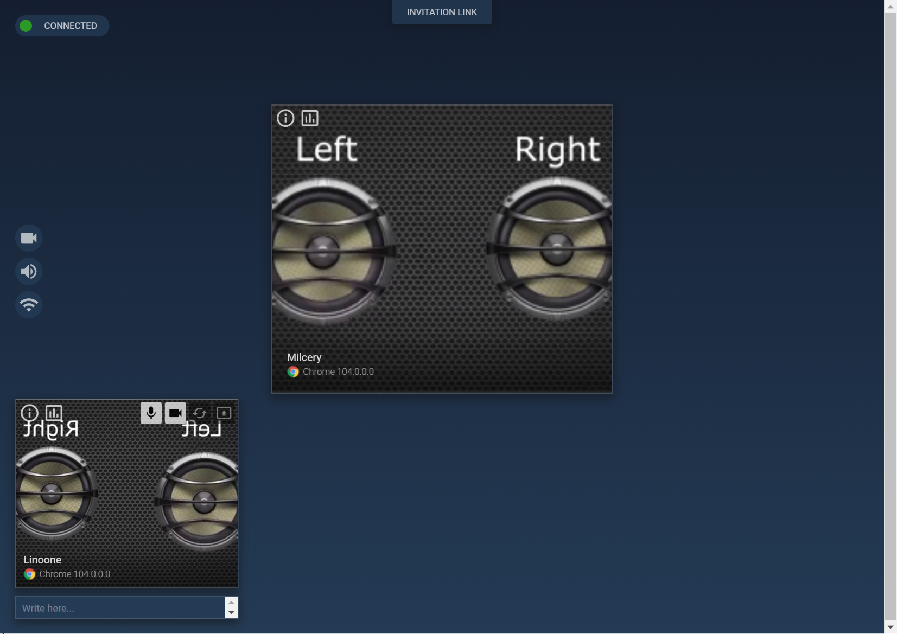

#mediasoup的web端demo的参数

### 1. 参数说明
    ```
    https://192.168.0.4:3000/?roomId=9527
    &info=true                 //显示统计信心
    &handler=Chrome74          //指定浏览器信息，做不同浏览器版本的兼容              
    &_throttleSecret=foo
    &consume=false
    &produce=false
    &forceTcp=true
    &forceVP9=true
    &forceH264=true 
    &useSimulcast=true,         //控制simulcast
    &useSharingSimulcast=true,  //控制屏幕共享的simulcast
    &svc=L1T1                   //控制svc
    &faceDetection=true         //开启人脸识别
    &externalVideo=true         //视频源来自一个用video标签里的mp4
    @datachannel=true           //支持datachannel
    @e2eKey                     //不知道是啥
    ```

### 2. 关于分辨率设置
    ```
    const VIDEO_CONSTRAINS =
    {
        qvga : { width: { ideal: 320 }, height: { ideal: 240 } },
        vga  : { width: { ideal: 640 }, height: { ideal: 480 } },
        hd   : { width: { ideal: 1920 }, height: { ideal: 1080 } }
    };
    
    this._webcam =
    {
        device     : null,
        resolution : 'hd'  //改这里
    };
    ```
### 3. 关于码率，simulcast，svc设置：
> scaleResolutionDownBy控制simulcast降采样比例
    
    ```
    // Used for simulcast webcam video.
    const WEBCAM_SIMULCAST_ENCODINGS =
    [
        { scaleResolutionDownBy: 4, maxBitrate: 500000 },
        { scaleResolutionDownBy: 2, maxBitrate: 1000000 },
        { scaleResolutionDownBy: 1, maxBitrate: 5000000 }
    ];
    
    // Used for VP9 webcam video.
    const WEBCAM_KSVC_ENCODINGS =
    [
        { scalabilityMode: 'S3T3_KEY' }
    ];
    
    // Used for simulcast screen sharing.
    const SCREEN_SHARING_SIMULCAST_ENCODINGS =
    [
        { dtx: true, maxBitrate: 1500000 },
        { dtx: true, maxBitrate: 6000000 }
    ];
    
    // Used for VP9 screen sharing.
    const SCREEN_SHARING_SVC_ENCODINGS =
    [
        { scalabilityMode: 'S3T3', dtx: true }
    ];
    ```
### 4. 开启人脸识别
 
### 5. 开启外部视频
 