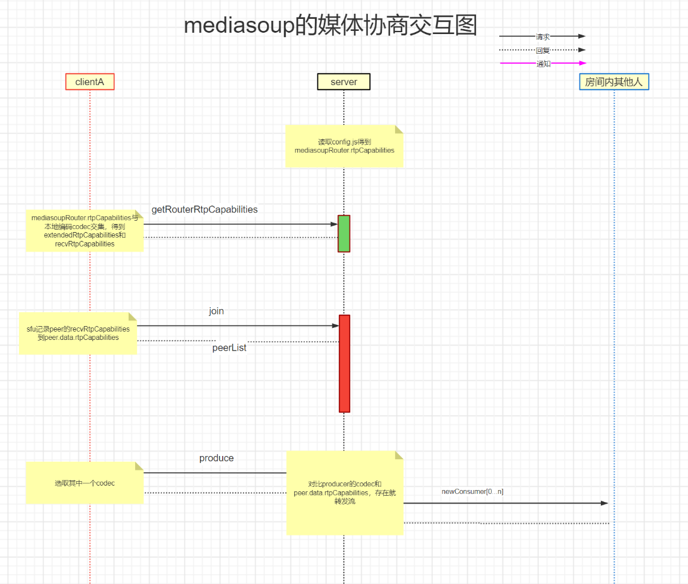

# mediasoup的媒体协商流程

> mediasoup干掉与sfu的媒体sdp协商，有自己的一套机制，因为发送和接收是两个通道，
> 协商就变成了看接收端是否支持某种codec和rtp扩展头，
> 媒体协商区别：webrtc自己是p2p机制，两端都列出自己的支持的编码解码，对方支持就可以。 sfu是分发，最好好房间里面都支持才可以。

### (一)整个流程
1. 首先sfu通过手动配置指定整个系统支持的所有编码格式。
    > 读取config.js让每个router得到mediasoupRouter.rtpCapabilities
   ```
   const { mediaCodecs } = config.mediasoup.routerOptions; ///Room.js, 来自config.js 
   const mediasoupRouter = await mediasoupWorker.createRouter({ mediaCodecs });  //Room.js
   const rtpCapabilities = ortc.generateRouterRtpCapabilities(mediaCodecs);  //Worker.js
   generateRouterRtpCapabilities(mediaCodecs) //ortc.js::
   ```
2. 客户端的编码工厂和解码工厂定义本客户端支持的全部codec
    > 通过信令`getRouterRtpCapabilities`拿到服务端支持的mediasoupRouter.rtpCapabilities
    ```
    //room.js
    case 'getRouterRtpCapabilities':
    {
        accept(this._mediasoupRouter.rtpCapabilities);
        break;
    }
    ```
3. 客户端取sfu和本客户端支持的codec的交集， 本地记录支持的编码codec交集。
   > 得到结果Device::extendedRtpCapabilities和recvRtpCapabilities 
   - 非常重要1：接收解码能力直接从来自extendedRtpCapabilities。不是来自本地解码工厂。
   - 非常重要2：extendedRtpCapabilities的排序以sfu为准。也就是sfu可以控制codec的优先级
   ```
   // Device::Load
   
   // 获取本地支持的编码 codec
   auto nativeRtpCapabilities = Handler::GetNativeRtpCapabilities(peerConnectionOptions);  
   
   //与router的codec求交集，排序以sfu为准
   this->extendedRtpCapabilities = ortc::getExtendedRtpCapabilities(nativeRtpCapabilities, routerRtpCapabilities);
   
   //直接从extendedRtpCapabilities计算出recvRtpCapabilities
   this->recvRtpCapabilities = ortc::getRecvRtpCapabilities(this->extendedRtpCapabilities);
   ```
   
4. join时候记录到sfu我支持的解码codec
    > sfu记录peer的recvRtpCapabilities到peer.data.rtpCapabilities
    ```
   data["rtpCapabilities"] = device_->GetRtpCapabilities(); 
   websocket_->Request("join", data);
   
   const json& Device::GetRtpCapabilities() const
   {
        MSC_TRACE();
        
        if (!this->loaded)
            MSC_THROW_INVALID_STATE_ERROR("not loaded");
        
        return this->recvRtpCapabilities;
   }
   ```
4. 推流是取发送编码交集的第一个codec，只取一个，把流发给sfu。 当然取哪一个可以手动控制，有接口。
    >推流可以手动指定编码器codec_selected，为null不指定则extendedRtpCapabilities的第一个
    ```
   send_transport_->Produce(this, track, &encodings, nullptr, codec_selected)
   
   data["rtpParameters"] = rtpParameters;
   websocket_->Request("produce", data);
   ```
5. sfu收到流后，把房间里的每个人接收codec拿出来比对，你支持我就告诉你有流可以并转发给你
    ```
    async _createConsumer({ consumerPeer, producerPeer, producer })
	{
		// Optimization:
		// - Create the server-side Consumer in paused mode.
		// - Tell its Peer about it and wait for its response.
		// - Upon receipt of the response, resume the server-side Consumer.
		// - If video, this will mean a single key frame requested by the
		//   server-side Consumer (when resuming it).
		// - If audio (or video), it will avoid that RTP packets are received by the
		//   remote endpoint *before* the Consumer is locally created in the endpoint
		//   (and before the local SDP O/A procedure ends). If that happens (RTP
		//   packets are received before the SDP O/A is done) the PeerConnection may
		//   fail to associate the RTP stream.

		// NOTE: Don't create the Consumer if the remote Peer cannot consume it.
		if (
			!consumerPeer.data.rtpCapabilities ||
			!this._mediasoupRouter.canConsume(
				{
					producerId      : producer.id,
					rtpCapabilities : consumerPeer.data.rtpCapabilities
				})
		)
		{
			return;
		}
   ```

### (二)注意
1. 注意codec的顺序，客户端会以sfu的codec为标准
1. 会出现什么问题呢：某个接收端不支持这种格式，sfu就不转发给你。 
2. 所以sfu的全局codec不宜配置过多，只有大家都支持才配置。
3. 比如mediasoup-demo默认配置h264的mainprofile。 而pc端移动端默认都没有配置，就不会转发无法解码。

### (三)画一张交互图
