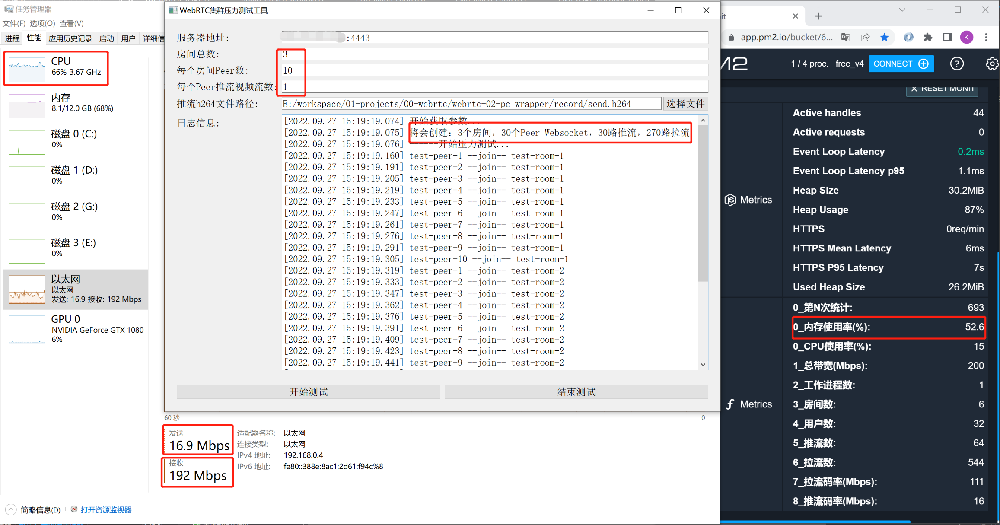
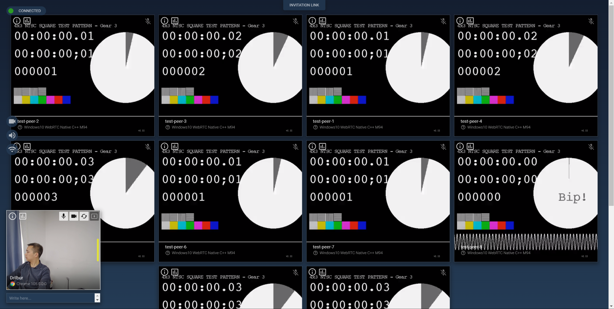

# 对webrtc和mediasoup进行压力测试

### （一）单个压测程序，目标
1. 压测10000个websocket
2. 压测100路视频推流
3. 压缩1000路视频拉流
4. 多个压测程序在不同的环境同时运行，实现超大规模的压测

### （二）方案
1. 在webrtc里, 实现一个视频编码器：读取指定测试264文件前面10帧到内存，然后循环推流内存数据。
2. 在webrtc里, 实现一个视频解码器：直接把数据丢掉。
3. 实现一个虚拟的VideoTrack，20fps放入帧。
4. 实现一个虚拟的音频设备模块Adm。

### （三）效果
- 实际的效果：推视频流30路，拉取视频流270路。

- 压入的每一路流都正常使用

### （四）一些结论
1. 瓶颈在带宽：阿里云200M带宽的测试服务器，跑满带宽也只需50%cpu占用。
2. 视频会议流量巨大
3. 还没开始测试集群