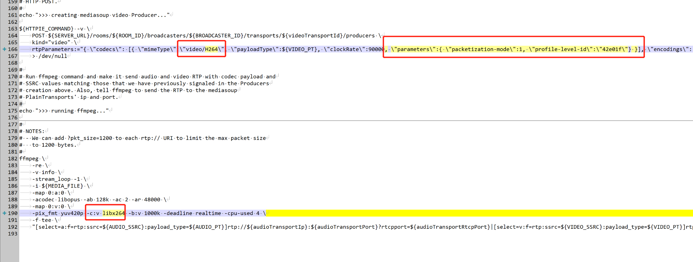
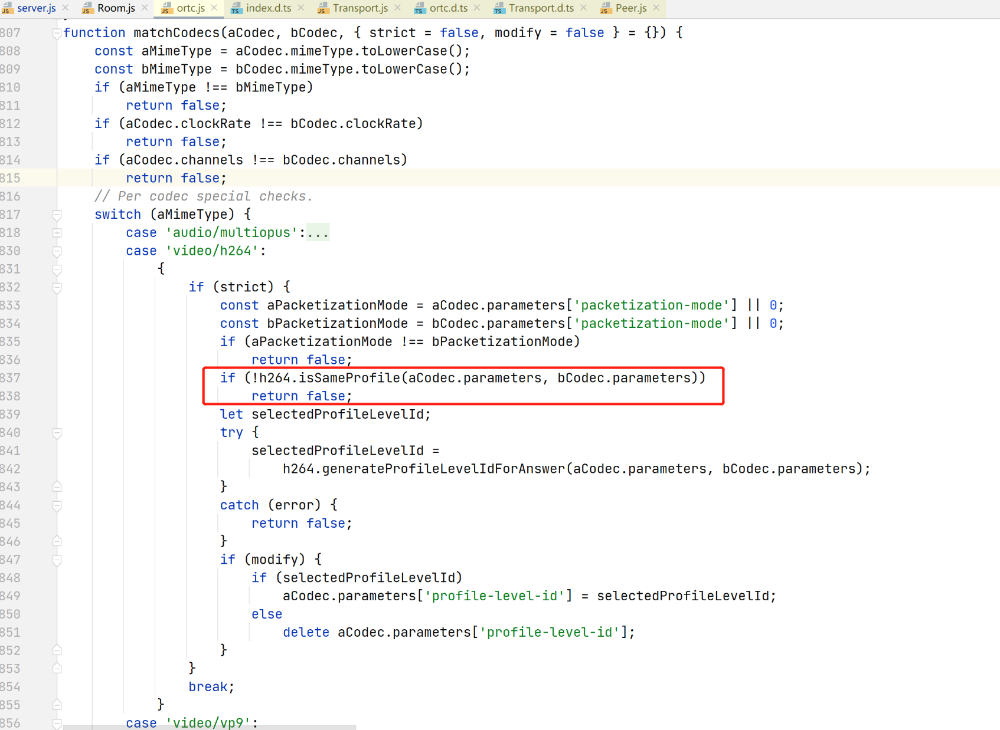

# mediasoup的Broadcaster与ffmpeg/gstreamer接入
> Broadcaster展示用http创建Transport进行推拉流，不需要websocket。
> 1. 不需要信令，ffmpeg，gstreamer等就能直接接入。
> 2. 不一定需要摄像头麦克风，纯音视频帧就能接入。

### 意义何在
1. Broadcaster的意义何在：展示一种整合的架构能力。
2. mediasoup worker没有Broadcaster的概念，后者是demo提出的。
3. Broadcaster也是一个peer，但是无法接收实时信令通知。用http信令实现创建transport，produce人，comsumer等。

### 两个示例
1. 官方Broadcaster-demo实现http信令创建webrtctransport发布手动合成音视频数据等。
    ```
    void Broadcaster::CreateSendTransport(bool enableAudio, bool useSimulcast)
    {
        std::cout << "[INFO] creating mediasoup send WebRtcTransport..." << std::endl;
    
        json sctpCapabilities = this->device.GetSctpCapabilities();
        /* clang-format off */
        json body =
        {
            { "type",    "webrtc" },
            { "rtcpMux", true     },
            { "sctpCapabilities", sctpCapabilities }
        };
        /* clang-format on */
    
        auto r = cpr::PostAsync(
                   cpr::Url{ this->baseUrl + "/broadcasters/" + this->id + "/transports" },
                   cpr::Body{ body.dump() },
                   cpr::Header{ { "Content-Type", "application/json" } },
                   cpr::VerifySsl{ verifySsl })
                   .get();
    
        if (r.status_code != 200)
        {
            std::cerr << "[ERROR] unable to create send mediasoup WebRtcTransport"
                      << " [status code:" << r.status_code << ", body:\"" << r.text << "\"]" << std::endl;
    
            return;
        }
    ...
    ```

2. mediasoup-demo/Broadcaster/ffmepg.sh和gstreamer.sh实现命令行调用http创建plainTransport实现ffmpeg从本地文件推流rtp流
    ```
    //MEDIA_FILE是一个本地文件，rtp://xxx就是plainTransport的推流地址地址
    ffmpeg \
        -re \
        -v info \
        -stream_loop -1 \
        -i ${MEDIA_FILE} \
        -map 0:a:0 \
        -acodec libopus -ab 128k -ac 2 -ar 48000 \
        -map 0:v:0 \
        -pix_fmt yuv420p -c:v libvpx -b:v 1000k -deadline realtime -cpu-used 4 \
        -f tee \
        "[select=a:f=rtp:ssrc=${AUDIO_SSRC}:payload_type=${AUDIO_PT}]rtp://${audioTransportIp}:${audioTransportPort}?rtcpport=${audioTransportRtcpPort}|[select=v:f=rtp:ssrc=${VIDEO_SSRC}:payload_type=${VIDEO_PT}]rtp://${videoTransportIp}:${videoTransportPort}?rtcpport=${videoTransportRtcpPort}"
    ```
   
    
## ffmpeg和gstreamer接入
3. mediasoup接入ffmpeg进行推拉流
    - 实现原理：使用PlainRtpTransport转发纯rtp包实现
    - 单通道单流：1个PlainRtpTransport是否只能推拉一路流，多路流rtp包混在一起ffmpeg能否解包。
    - 没有信令：peer和流的变化无法通知。
    - peer： 没有信令通知，就应独立于peers单独存在，不一定要join，能拿到producer列表就行拉流。
     
4. 推流流程：
    > 这里假设每1个PlainRtpTransport对应1路推流或者拉流
    
    - 在room内创建一个ffmpegPeer
    - 创建server的rtp接收端：给ffmpegPeer创建PlainRtpTransport，返回得到服务端监听的ip和端口。
    - 创建produce流：流的rtpParameters编码格式参数。
    - 用gstreamer或者ffmpeg 往 服务端监听的ip和端口 推送rtp包。

4. 拉流流程：
    > 这里假设每1个PlainRtpTransport对应1路推流或者拉流
    - 在room内创建一个ffmpegPeer，可以推拉流共用
    - 创建server的rtp接收端：给ffmpegPeer创建PlainRtpTransport，返回得到服务端监听的ip和端口。
    - 创建consumer
    - connect到PlainRtpTransport：把本地的接收端口给到服务器
    - 用gstreamer或者ffmpeg在本地端口 接收rtp包
6. 参考实现[https://blog.csdn.net/weixin_29405665/article/details/111994983](https://blog.csdn.net/weixin_29405665/article/details/111994983)

7. 解决ffmpeg利用boardcaster推流h264到mediasoup sfu的bug


ffmpeg.sh
```
#!/usr/bin/env bash

function show_usage()
{
	echo
	echo "USAGE"
	echo "-----"
	echo
	echo "  SERVER_URL=https://my.mediasoup-demo.org:4443 ROOM_ID=test MEDIA_FILE=./test.mp4 ./ffmpeg.sh"
	echo
	echo "  where:"
	echo "  - SERVER_URL is the URL of the mediasoup-demo API server"
	echo "  - ROOM_ID is the id of the mediasoup-demo room (it must exist in advance)"
	echo "  - MEDIA_FILE is the path to a audio+video file (such as a .mp4 file)"
	echo
	echo "REQUIREMENTS"
	echo "------------"
	echo
	echo "  - ffmpeg: stream audio and video (https://www.ffmpeg.org)"
	echo "  - httpie: command line HTTP client (https://httpie.org)"
	echo "  - jq: command-line JSON processor (https://stedolan.github.io/jq)"
	echo
}

echo

SERVER_URL=https://127.0.0.1:4443
ROOM_ID=1
MEDIA_FILE=H:/video/视频测试样例视频bipbop/bipbop-baseline.mp4
if [ -z "${SERVER_URL}" ] ; then
	>&2 echo "ERROR: missing SERVER_URL environment variable"
	show_usage
	exit 1
fi

if [ -z "${ROOM_ID}" ] ; then
	>&2 echo "ERROR: missing ROOM_ID environment variable"
	show_usage
	exit 1
fi

if [ -z "${MEDIA_FILE}" ] ; then
	>&2 echo "ERROR: missing MEDIA_FILE environment variable"
	show_usage
	exit 1
fi

if [ "$(command -v ffmpeg)" == "" ] ; then
	>&2 echo "ERROR: ffmpeg command not found, must install FFmpeg"
	show_usage
	exit 1
fi

if [ "$(command -v http)" == "" ] ; then
	>&2 echo "ERROR: http command not found, must install httpie"
	show_usage
	exit 1
fi

if [ "$(command -v jq)" == "" ] ; then
	>&2 echo "ERROR: jq command not found, must install jq"
	show_usage
	exit 1
fi

set -e

BROADCASTER_ID=$(LC_CTYPE=C tr -dc A-Za-z0-9 < /dev/urandom | fold -w ${1:-32} | head -n 1)
HTTPIE_COMMAND="http --check-status --verify no"
AUDIO_SSRC=1111
AUDIO_PT=100
VIDEO_SSRC=2222
VIDEO_PT=102

#
# Verify that a room with id ROOM_ID does exist by sending a simlpe HTTP GET. If
# not abort since we are not allowed to initiate a room..
#
echo ">>> verifying that room '${ROOM_ID}' exists..."

${HTTPIE_COMMAND} \
	GET ${SERVER_URL}/rooms/${ROOM_ID} > /dev/null

#
# Create a Broadcaster entity in the server by sending a POST with our metadata.
# Note that this is not related to mediasoup at all, but will become just a JS
# object in the Node.js application to hold our metadata and mediasoup Transports
# and Producers.
#
echo ">>> creating Broadcaster..."

${HTTPIE_COMMAND} \
	POST ${SERVER_URL}/rooms/${ROOM_ID}/broadcasters \
	id="${BROADCASTER_ID}" \
	displayName="Broadcaster" \
	device:='{"name": "FFmpeg"}' \
	> /dev/null

#
# Upon script termination delete the Broadcaster in the server by sending a
# HTTP DELETE.
#
trap 'echo ">>> script exited with status code $?"; ${HTTPIE_COMMAND} DELETE ${SERVER_URL}/rooms/${ROOM_ID}/broadcasters/${BROADCASTER_ID} > /dev/null' EXIT

#
# Create a PlainTransport in the mediasoup to send our audio using plain RTP
# over UDP. Do it via HTTP post specifying type:"plain" and comedia:true and
# rtcpMux:false.
#
echo ">>> creating mediasoup PlainTransport for producing audio..."

res=$(${HTTPIE_COMMAND} \
	POST ${SERVER_URL}/rooms/${ROOM_ID}/broadcasters/${BROADCASTER_ID}/transports \
	type="plain" \
	comedia:=true \
	rtcpMux:=false \
	2> /dev/null)

#
# Parse JSON response into Shell variables and extract the PlainTransport id,
# IP, port and RTCP port.
#
eval "$(echo ${res} | jq -r '@sh "audioTransportId=\(.id) audioTransportIp=\(.ip) audioTransportPort=\(.port) audioTransportRtcpPort=\(.rtcpPort)"')"

#
# Create a PlainTransport in the mediasoup to send our video using plain RTP
# over UDP. Do it via HTTP post specifying type:"plain" and comedia:true and
# rtcpMux:false.
#
echo ">>> creating mediasoup PlainTransport for producing video..."

res=$(${HTTPIE_COMMAND} \
	POST ${SERVER_URL}/rooms/${ROOM_ID}/broadcasters/${BROADCASTER_ID}/transports \
	type="plain" \
	comedia:=true \
	rtcpMux:=false \
	2> /dev/null)

#
# Parse JSON response into Shell variables and extract the PlainTransport id,
# IP, port and RTCP port.
#
eval "$(echo ${res} | jq -r '@sh "videoTransportId=\(.id) videoTransportIp=\(.ip) videoTransportPort=\(.port) videoTransportRtcpPort=\(.rtcpPort)"')"

#
# Create a mediasoup Producer to send audio by sending our RTP parameters via a
# HTTP POST.
#
echo ">>> creating mediasoup audio Producer..."

${HTTPIE_COMMAND} -v \
	POST ${SERVER_URL}/rooms/${ROOM_ID}/broadcasters/${BROADCASTER_ID}/transports/${audioTransportId}/producers \
	kind="audio" \
	rtpParameters:="{ \"codecs\": [{ \"mimeType\":\"audio/opus\", \"payloadType\":${AUDIO_PT}, \"clockRate\":48000, \"channels\":2, \"parameters\":{ \"sprop-stereo\":1 } }], \"encodings\": [{ \"ssrc\":${AUDIO_SSRC} }] }" \
	> /dev/null

#
# Create a mediasoup Producer to send video by sending our RTP parameters via a
# HTTP POST.
#
echo ">>> creating mediasoup video Producer..."

${HTTPIE_COMMAND} -v \
	POST ${SERVER_URL}/rooms/${ROOM_ID}/broadcasters/${BROADCASTER_ID}/transports/${videoTransportId}/producers \
	kind="video" \
	rtpParameters:="{ \"codecs\": [{ \"mimeType\":\"video/H264\", \"payloadType\":${VIDEO_PT}, \"clockRate\":90000, \"parameters\":{ \"packetization-mode\":1, \"profile-level-id\":\"42e01f\"} }], \"encodings\": [{ \"ssrc\":${VIDEO_SSRC} }] }" \
	> /dev/null

#
# Run ffmpeg command and make it send audio and video RTP with codec payload and
# SSRC values matching those that we have previously signaled in the Producers
# creation above. Also, tell ffmpeg to send the RTP to the mediasoup
# PlainTransports' ip and port.
#
echo ">>> running ffmpeg..."

#
# NOTES:
# - We can add ?pkt_size=1200 to each rtp:// URI to limit the max packet size
#   to 1200 bytes.
#
ffmpeg \
	-re \
	-v info \
	-stream_loop -1 \
	-i ${MEDIA_FILE} \
	-map 0:a:0 \
	-acodec libopus -ab 128k -ac 2 -ar 48000 \
	-map 0:v:0 \
	-pix_fmt yuv420p -c:v libx264 -b:v 1000k -deadline realtime -cpu-used 4 \
	-f tee \
	"[select=a:f=rtp:ssrc=${AUDIO_SSRC}:payload_type=${AUDIO_PT}]rtp://${audioTransportIp}:${audioTransportPort}?rtcpport=${audioTransportRtcpPort}|[select=v:f=rtp:ssrc=${VIDEO_SSRC}:payload_type=${VIDEO_PT}]rtp://${videoTransportIp}:${videoTransportPort}?rtcpport=${videoTransportRtcpPort}"

```
