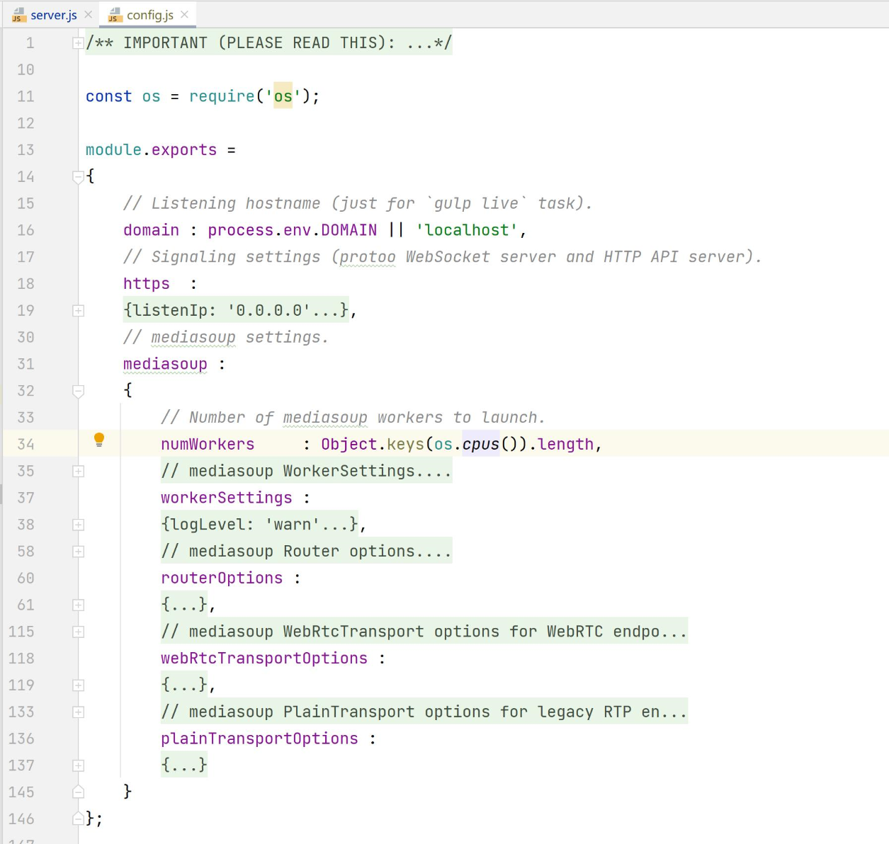
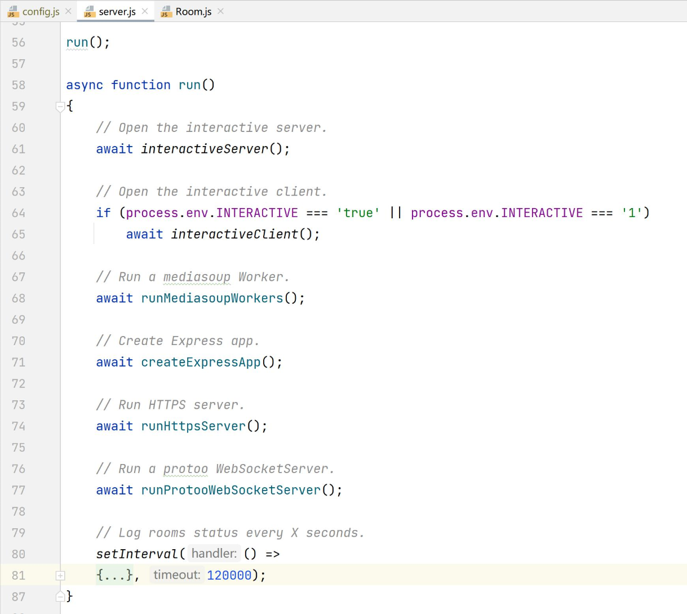
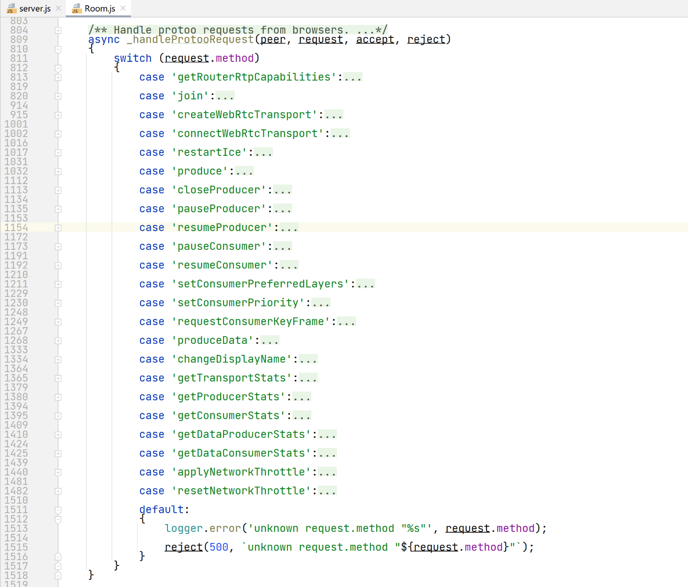

# media-demo-server源码入门
- config.js
- server.js
    - https服务：api，broadcaster。
    - websocket服务：也用到了httpsserver。
        - accept()为每个客户端生成一个protooWebSocketTransport，给room处理进行消息监听。
    - worker多进程
- interactiveClient.js支持的命令，调用worker内的dump相关函数内部实现
```
available commands:
- h,  help                    : show this message
- usage                       : show CPU and memory usage of the Node.js and mediasoup-worker processes
- ddp, dumpDataProducer [id]  : dump mediasoup DataProducer with given id (or the latest created one)
- ddc, dumpDataConsumer [id]  : dump mediasoup DataConsumer with given id (or the latest created one)
- st, statsTransport [id]     : get stats for mediasoup Transport with given id (or the latest created one)
- sp, statsProducer [id]      : get stats for mediasoup Producer with given id (or the latest created one)
- sc, statsConsumer [id]      : get stats for mediasoup Consumer with given id (or the latest created one)
- sdp, statsDataProducer [id] : get stats for mediasoup DataProducer with given id (or the latest created one)
- sdc, statsDataConsumer [id] : get stats for mediasoup DataConsumer with given id (or the latest created one)
- hs, heapsnapshot            : write a heapdump snapshot to file
- t,  terminal                : open Node REPL Terminal
```


