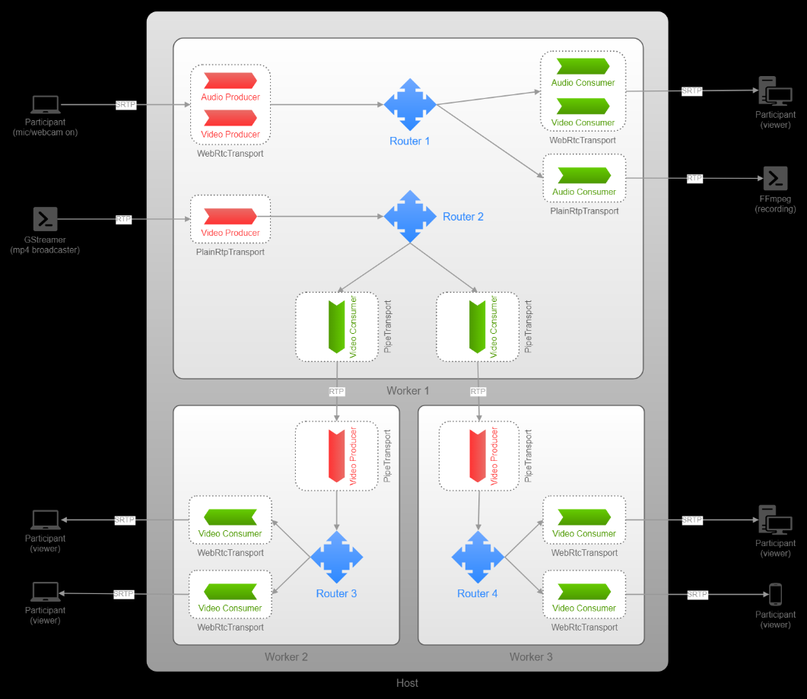
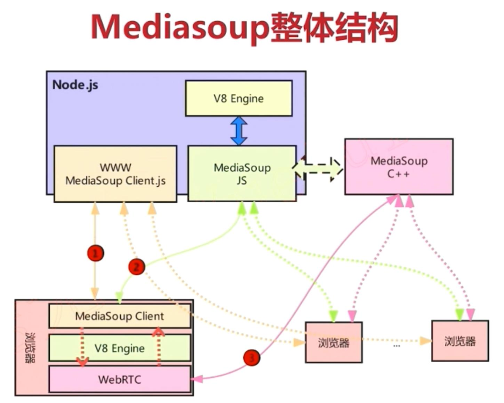
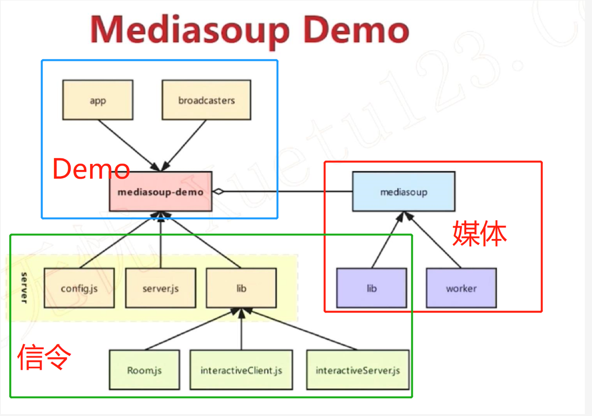
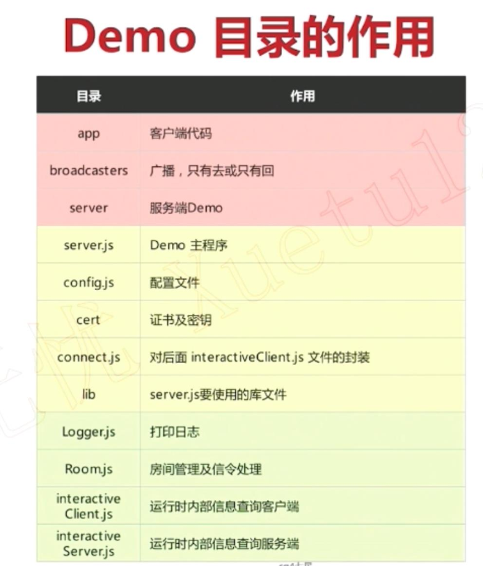
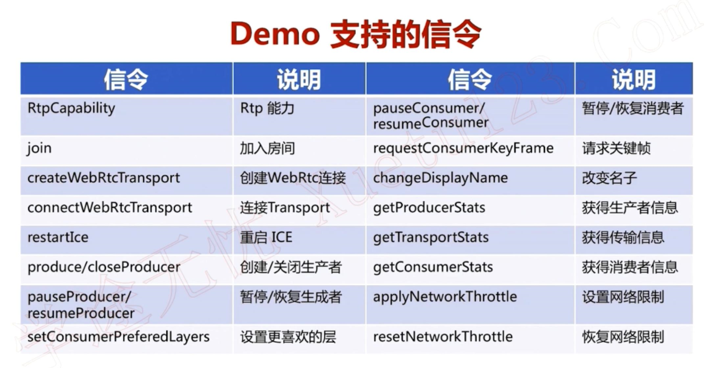
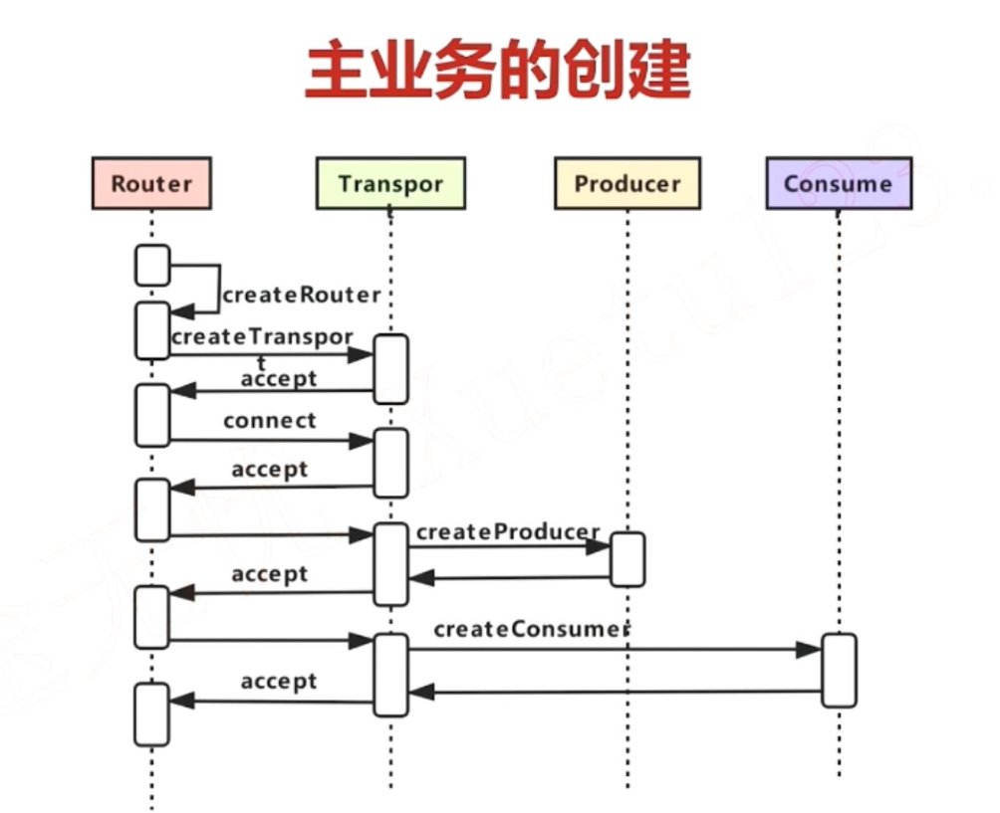
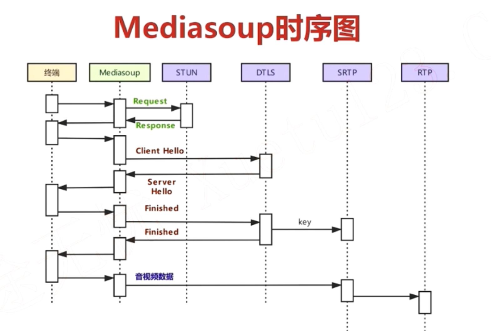
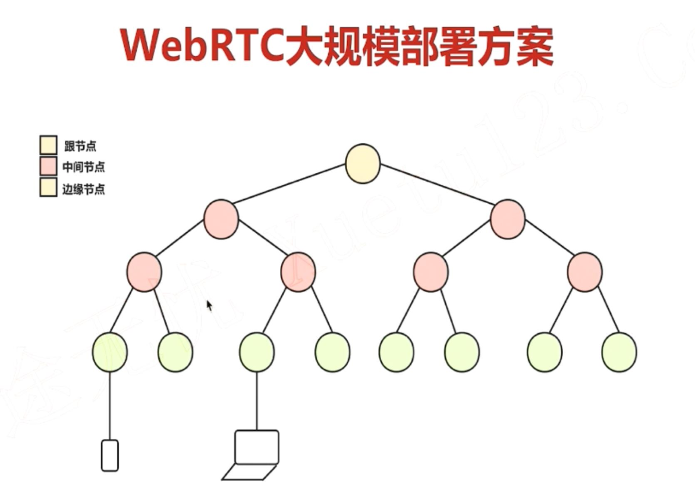
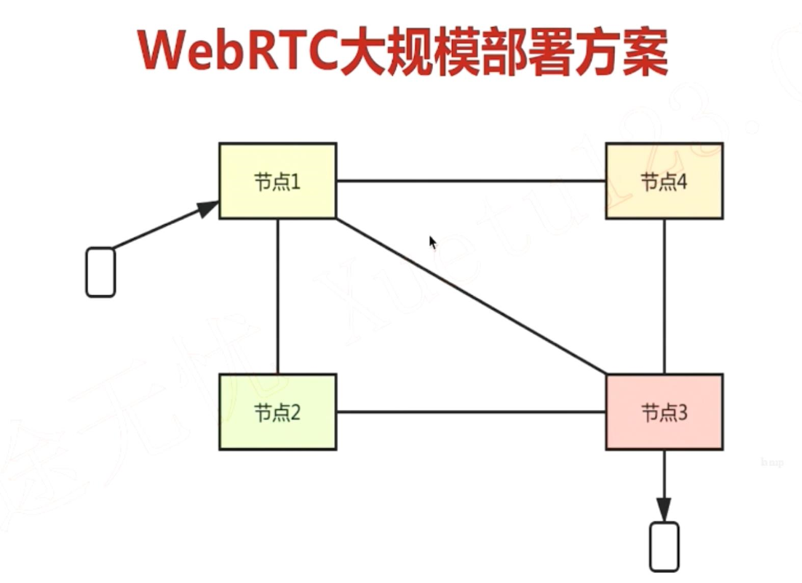
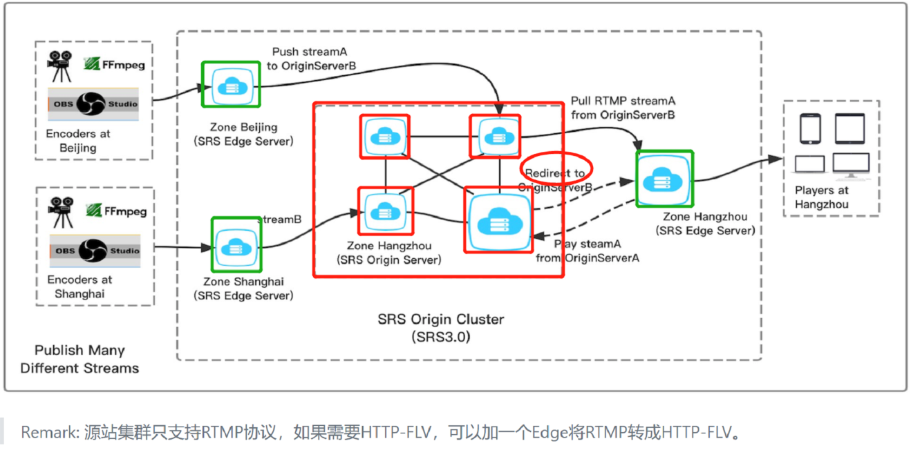

mediasoup demo server的对象模型

### 一.架构图

### 二.对象模型
- expressApp/httpsServer/protooWebSocketServer/queue
- mediasoupWorkers：[]<Worker>
- rooms：Map<Room>     //最后一个人离开后删除
    - _mediasoupRouter：MediasoupRouter
    - _audioLevelObserver: AudioLevelObserver //监听音量
    - _bot：Bot
    - _protooRoom：protoo.Room
        - _peers：Map<Peer>
            - _transport：protoo.WebSocketTransport
            - _data：{}
                - consume //是否自动创建consume
                - joined      //是否加入
                - displayName //昵称
                - device           //设备信息
                - rtpCapabilities
                - sctpCapabilities
                - transports: Map         //创建的通道列表，createWebRtcTransport信令创建，peer离开时全部关闭。
                - producers: Map          //创建的producer列表，produce/closeProducer信令创建和删除。
                - consumers: Map          //创建的consumer列表，produce/closeProducer时候createConsumer创建和删除。
                - dataProducers: Map     //创建的DataProducer列表：类似上面。
                - dataConsumers: Map   //创建的DataConsumer列表：类似上面。
### 三.《李超老师的课程学习》
1. 基础知识：
    - node.js 是一个基于 Chrome V8 引擎的 JavaScirpt 运行环境。
    - 后端语言：c++，java，python(Django 、Flask、Tornado)，nodejs，go(Golang Gin)，php等等。
    - meidasoup：nodejs+c++。 跨平台的
    - meidasoup是多端口方案。
    - 用轮询的方式调度worker。
    - api文档 https://mediasoup.org/documentation/v3/mediasoup/api/
2. 整体架构
    
3. 服务
    - www服务：https：API server to manage Broadcaster requests
    - 信令服务：websocket
    - 媒体服务：dtls+srtp
4. 部署环境安装
    - Ubuntu18.04，nodejs10.0以上，npm6.4.1，gulp2.2.0
    - 二进制安装：apt-get/yum/brew install nodejs ，nodejs自带
    - 源码安装：下载编译nodejs
5. demo部署：https://github.com/versatica/mediasoup-demo
    - server(信令和媒体服务器)：改两个ip、https参数、媒体配置。npm安装模块和运行。
    - 生成证书：openssl req -new -newkey rsa:1024 -x509 -sha256 -days 3650 -nodes -out fullchain.pem -keyout privkey.pem
    - app(web程序)：npm+gulp安装模块和运行。
6. demo二次开发
    - 用nodejs的http和express，serve-index模块开发一个http/https服务
    - 自己写了一个https服务发布demo。
7. demo架构
    
    
8. js语法：chrome的debug模式直接编写js
    - 基础语法(6个)：变量与类型，基本运算，条件，循环，函数，console.log(x)。
    - 面向对象(6个)：类，构造函数structor，私有成员和方法_xxx，数组扩展符号...，解构赋值{}=object，导出模块export.modules。
    - 高级特性(2个)：Promise，EventEmitter
9. 分析server.js：500多行，比较简单。启动媒体和信令服务。
    - 读取配置
    - interactiveServer/interactiveClient
    - runMediasoupWorkers-->mediasoup\node\lib\index.js-->mediasoup\node\lib\Worker.js：启动媒体服务
    - createExpressApp + runHttpsServer：管理Broadcaster请求
    - runProtooWebSocketServer：启动信令服务
    - setInterval：room.logStatus()
10. 分析Room.js：1700多行
    - 都是房间：Room/Router：js业务层的房间/c++层的的房间
    - Transport/WebRtcTransport
    - Produce/Consume
    - 功能：创建房间，信令处理
    - 20个左右的信令：
    
    - 业务层的room：包含protoo的room和c++的router。
11. demo调试与dump工具
    - node --inspect-brk server.js
    - 在浏览器输入chrome://inspect，选择server.js，设置断点
    - 另启浏览器发送创建房间请求开始调试。
    - 两种dump方法：export INTERACTIVE=1 && node server.js 和 node server.js && node connect.js。
12. 主业务流程： 
    - worker的主要处理四个信令：
    - worker_dump，worker_update_setting，worker_create_router,router_close
    - 其他的交给router。router信令：
        - router_dump
        - router_create_webrtc_transport
        - 其他交给transport：
            - transport_producer：创建生产者
            - transport_consumer：创建消费者。消费者类型：simple，simulcast，

13. 安全验证：
    - 服务端生成ice-ufrags和ice-password 返回的客户端，然后stun协议带上。
    - ice-role：默认服务端是client
    - fingerprint：证书的指纹。
14. rtc大规模部署方案3各方案：
    - 场景：音视频，udp，客户端必须直连可能不同结点，不能nginx全局转发。
    - 要求：分区域就近接入，尽量少的转发。
        - 方案一：树状分级级联。缺点：跨区访问时，根节点或者中间节点压力大。
        - 方案二：全节点对等。缺点：需要测速找最优路径。
        - 方案三：源站和边缘。缺点：需要配置管理节点网络结构。
        - 方案四：全节点对等+区域调度+namespace隔离+redis
        
        
        
15. srs的集群部署：
    1. 区分：源站节点和边缘节点。
    2. 源站每两个节点之间都是联通的。
    3. 边缘节点要指定所使用的源站节点(1到n个)。
    4. 边缘节点的内部联通不需要经过源站。
    5. 源站集群做主干网络完成跨区域访问，边缘节点就近访问。
    6.源站集群内部做重定向减少转发。
    7. 支持虚拟主机隔离
    