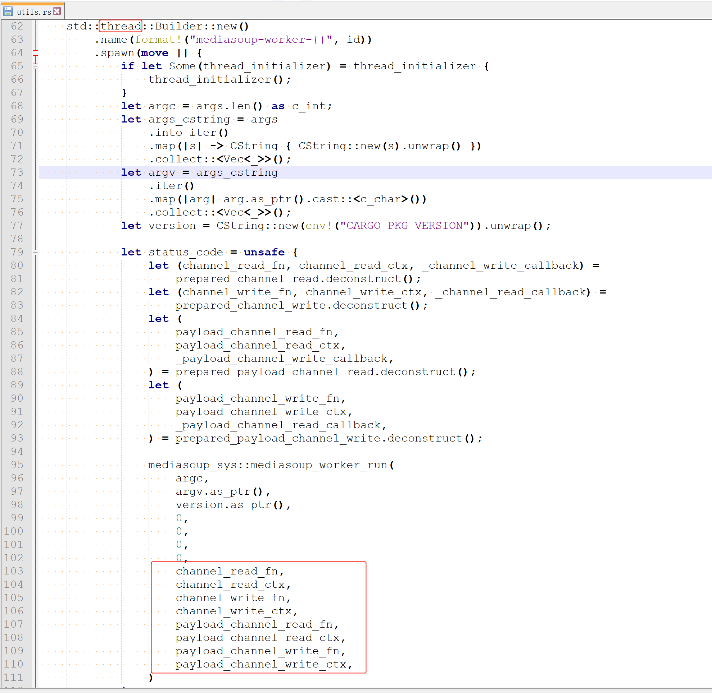
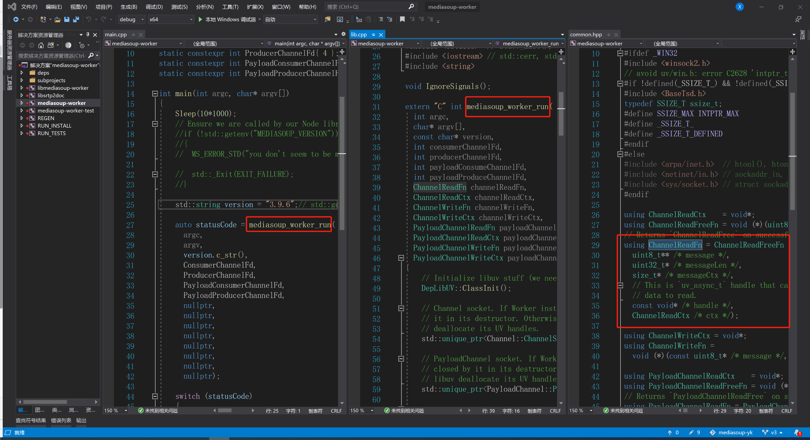
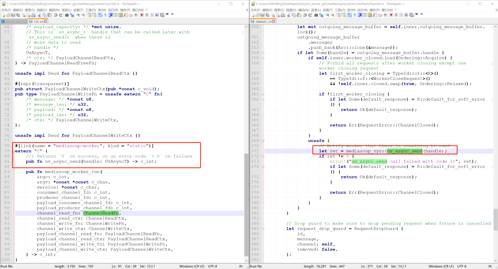

## mediasoup的rust接口与worker的启动方式

### 一. mediasoup的rust接口
1. rust是nodejs的一种替代方案。并不是替代worker。
2. rust与worker的交互：
    - **每个线程启动一个worker，然后用四个回调函数来通讯。这跟nodejs与worker间的跨进程管道通讯完成不同。**
    - 线程体：直接调用worker c++的mediasoup_worker_run函数。
    - rust启动worker的代码截图：
    
    - mediasoup_worker_run代码截图：
    
3. 项目组成：worker用的静态库
    ```
    [workspace]
    members = [
        "rust", //实现rust版本的sdk和 examples
        "worker" //用make编译libmediasoup-worker静态库
    ]
    ```
4. 示例
启动两个线程rust/examples/videorooms.rs
    ```
    let rooms_registry = Data::new(RoomsRegistry::default());
        HttpServer::new(move || {
            App::new()
                .app_data(worker_manager.clone())
                .app_data(rooms_registry.clone())
                .route("/ws", web::get().to(ws_index))
        })
        // 2 threads is plenty for this example, default is to have as many threads as CPU cores
        .workers(2) 
        .bind("127.0.0.1:3000")?
        .run()
        .await
    ```
### 二. worker的启动方式
5. 用静态库和动态库的方式使用worker我做完，需要导出libuv的函数uv_async_send，用于线程间通讯告诉worker有信令需要通过ChannelReadFn读取
    - 每次发信令，都要调uv_async_send告诉worker来取信令
    - 有信令channelReadFn就返回 信令参数的释放函数，没有就返回空。 channelReadFn不能阻塞，不能耗时。
    - worker会在一开始把 异步通信对象 uv_async_t 给出来,当然调用每次ChannelReadFn也会给.    -  
    - **worker很多组件使用了thread_local，建议保证每个worker在一个对立的线程里面**
    - **nodejs默认单线程，rust或者golang都是多线程，注意加锁**
    
### 三. 扩展
5. 从mediasoup-rust看高并发架构的发展：(以下摘自srs的公众号)
    - **第一代高并发架构**：1990～2010年，多线程架构，一般比较老的服务器都是这种架构，一般无法解决C10K[1]问题，比如Adobe AMS[2]，Apache HTTP Server[3]，Janus WebRTC Server[4]。核心问题是多线程的水平扩展性问题，并发越多，线程之间的同步和竞争开销就越大（这个问题也是现代语言Go在性能方面的硬伤，特别是在超多CPU比如64核或128核时，多线程的损耗会更大）。
    - **第二代高并发架构**：2010～2020年，单线程架构，多进程或单进程单线程都是这种架构，C10K问题得到比较好的解决，比如Nginx[5]，SRS[6]，MediaSoup[7]。核心问题是单线程引入的异步回调问题[8]，新的语言比如Go引入轻量线程goroutine（协程）解决这个问题，老的语言比如C++20、JS await等都有对应的机制。另外多进程的进程间通信也会引入额外复杂性，比如直播和RTC的流的跨进程回源和拉流问题。
    - **第三代高并发架构**：隔离的多线程架构，比如云原生的数据面反向代理Envoy线程模型[9]，还有比Nginx更高性能的反向代理么，这就是Envoy[10]了，如下图所示。其实Envoy和Nginx都是事件驱动，但是Envoy是完全非阻塞[11]。而Envoy的多线程实际上和第一代的多线程也不同，线程之间几乎没有交互，可以看作是隔离的进程。由于是线程，所以它们之间的（少量）通信也很容易。同样，多线程也可以和轻量线程结合使用。
