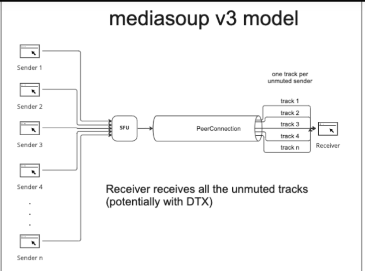
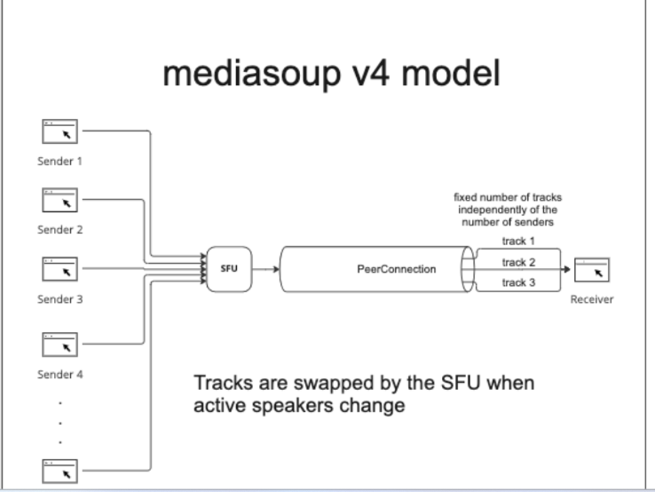

# mediasoup-v4新功能预测-只分发有限路数的流并动态切换
>sfu性能提升：sfu可以减少音频流下发路数，视频流人多了客户端要切低分辨率。

### 一. 引出讨论
1. sfu的特点就是流的数量大，房间内的流数量呈指数增长：视频或音频路数都=人数的平方。
2. 这些流全部分发是否必须？比如音频只有1-3个人正在讲话，全部分发是否有意义。
3. 据说v4，就只分发有限路数的流，比如3路； 而且流根据人声检测真正讲话的流动态的切换分发。

### 二. 猜测(这是本文的重点)
1. 主要在音频流上实现。视频流也可以就要求客户端看不到某些成员的画面。
1. **只会在sfu做实现，不会要求推流和拉流端做额外的工作。**
2. **用audio level扩展头检测真正讲话的人就行了，没必要再去VAD静音检测。否则需要编解码浪费cpu。**
3. **那估计要增加一个信令告诉客户端当前音频流是谁的声音，是谁在讲话。**
4. **最多路数应该要做到客户端可配置。**
5. 意义：虽然音频的带宽占比不高，但是在大房间情况下可以介绍一点带宽消耗，也可以减少客户端的音频处理损耗。

### 三. 扩展-看看视频如何减少
1. 会议、课堂一般都会全流拉取，直播、监控一般不需要。
2. sfu的1个10人会议室，就是100路视频+100路音频；多一些并发轻易就可能上几万路流。
3. 比如房间里10路1080p，采用smulcast/svc流，拉流端应该主动切到1路1080+9路480。
4. 总的分辨率20k(10x1920)变成4k(1x1080+9x480)；分辨率小了，码率小了，宏块少解码消耗低。
6. 更多，参考[视频会议中优化sfu以吸取mcu的优点](21-mediasoup_sfu_vs_mcu.md)

### 四. 看看架构图

