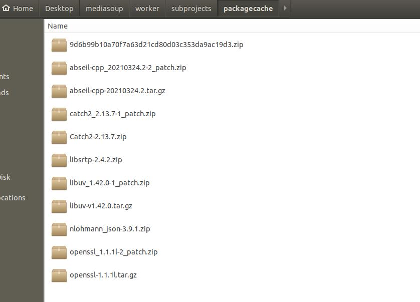

# mediasoup和mediasoup-demo编译

1. 依赖：
   - 支持linux，windows和mac的编译
   - nodejs
   - gcc4.9 or clang （可能用较新的ubuntu）, python3和make：这些编译worker c++需要。
   - nodejs 版本问题报错，可能会用到：npm install --legacy-peer-deps
2. 编译：按照 [mediasoup-demo官网](https://github.com/versatica/mediasoup-demo) 的说明npm install；npm start编译就行
3. 编译worker的工具是meson, meson的依赖需要翻墙下载，原因是：
   - 各个依赖包会从各自官网下载，可能需要翻墙。
   - 依赖包的补丁包，meson用python从https://wrapdb.mesonbuild.com/v2/openssl_1.1.1l-2/get_patch下载patch包的时候重定向到https://objects.githubusercontent.com，githubusercontent需要翻墙。
   - 依赖包列表，可以把旧项目的packagecache缓存包拷贝到新的项目避免下载
      
4. 下载时候openssl证书验证失败：
    - Python安装目录(如C:\Anaconda3)\Lib\urllib\request.py 在import ssl后加入了一行(不用了记得改回去)：
    ```
      ssl._create_default_https_context = ssl._create_unverified_context
    ```
