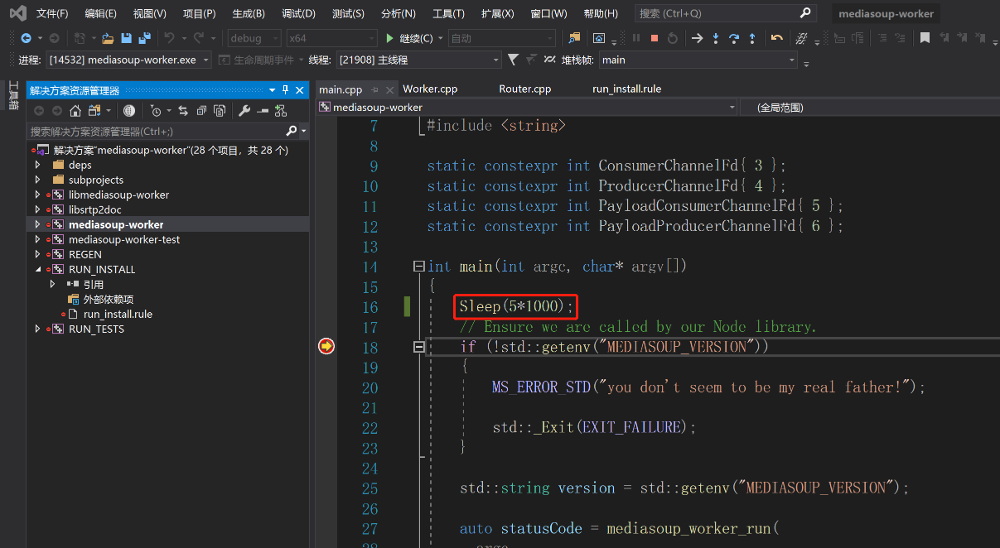
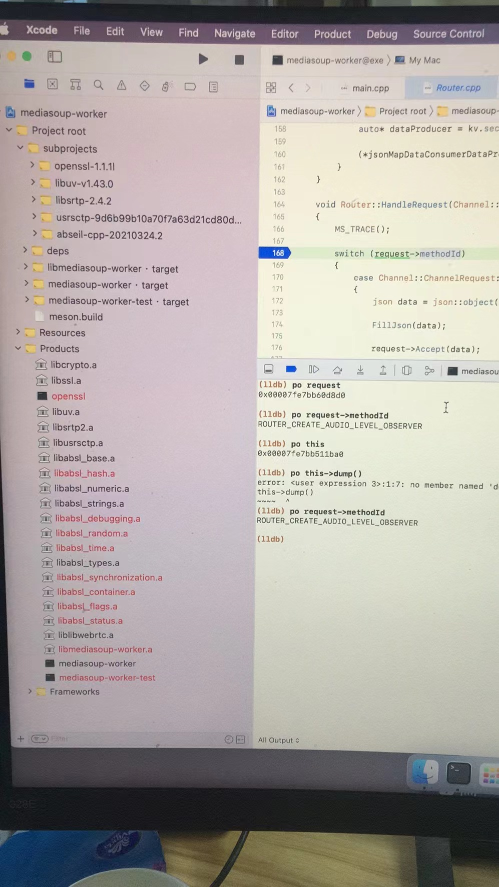
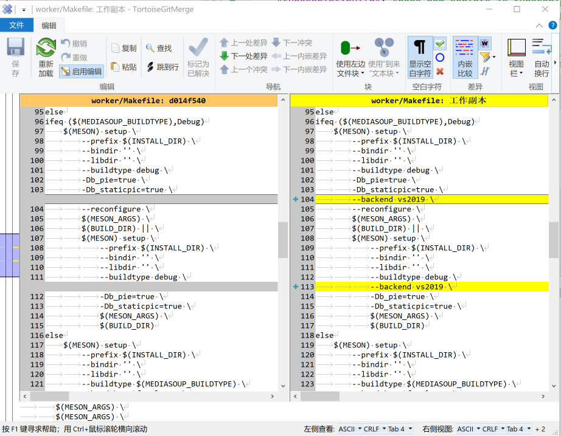

# mediasoup的c++调试(vs2019/xcode/gdb)
先上效果：



如果你很熟悉mediasoup，请直接看实践部分

## 一. 为什么写这个
1. 因为mediasoup默认使用js接口跨进程调用c++核心模块worker实现；
2. 所以导致关键的c++核心代码调试稍微麻烦；
3. 开发中使用Visual Studio/xcode/gdb/qtcreator随心所欲的调试能极大的提高效率；
4. **所以本文主要说明worker的c++代码调试方法；**
5. 而js调试比较简单就不做说明，比如使用WebStorm。

## 二. c++基本调试原理
1. 【IDE项目】创建vs2019/xcode/gdb项目，启动程序调试。
2. 【Debug编译】编译带调试符号的程序，比如debug程序。程序里面记录了源码的位置。
3. 【附加调试】如果被调试进程不是vs2019/xcode/gdb启动，需要attach附加到进程调试。

## 三. mediasoup-worker的c++调试原理
1. 【IDE项目】meson默认采用ninja，但也支持vs2019/vs2017/xcode等，所以修改makefile，让meson生成vs2019/xcode项目。
2. 【Debug编译】编译出debug版本的worker。
3. 【附加调试】worker是用nodejs启动的，必须用attach附加到进程调试。
 
## 四. mediasoup-worker的c++调试实践
1. 按照默认的方式把mediasoup-demo编译好。
2. 进入mediasoup-demo/server/node_modules/mediasoup/worker：
3. 修改Makefile添加两行：vs2019处也可以时xcode或vs2017，vs2022等

4. 编译Debug版本的worker和生成vs2019项目：
   ```
   set MEDIASOUP_BUILDTYPE=Debug && make
   ```
5. 启动nodejs的server：
   ```
   set MEDIASOUP_BUILDTYPE=Debug && node ../../../server.js
   ```
6. vs2019打开生成的vs项目，附加到进程调试。
7. 附加到进程调试要等进程先启动，这样调试时已经运行一段时间了，为了能从main函数开始调试我加了sleep，也有别的方法:[自动附近进程调试](https://tech.powereasy.net/cpzsk/wzfwqwlaq/content_22337?SessionVerify=aaac10bc-b0da-46bf-a9bd-8e268f7622b8) 或者 [官方文档](https://docs.microsoft.com/zh-cn/previous-versions/visualstudio/visual-studio-2010/a329t4ed(v=vs.100)?redirectedfrom=MSDN);

## 五. 其他知识
1. 调试时，如果源码的位置有变动要做地址映射。比如代码拷贝多份后要调试或者别的机器编译的在本机调试。
2. mediasoup-worker的c++编译说明：
    - makefile：下载安装meson和ninja，调用meson
    - meson：用python写的c++编译工具，自动下载和管理依赖库。需要python环境。
3. mediasoup运行：mediasoup-demo通过nodejs调用 mediasoup的js接口跨进程调用mediasoup-worker。
    - mediasoup-worker：c++的webrtc核心库，编译是exe。
    - mediasoup：mediasoup的js接口 + mediasoup-worker。
    - mediasoup-demo：使用mediasoup的js接口开发的SFU服务器。