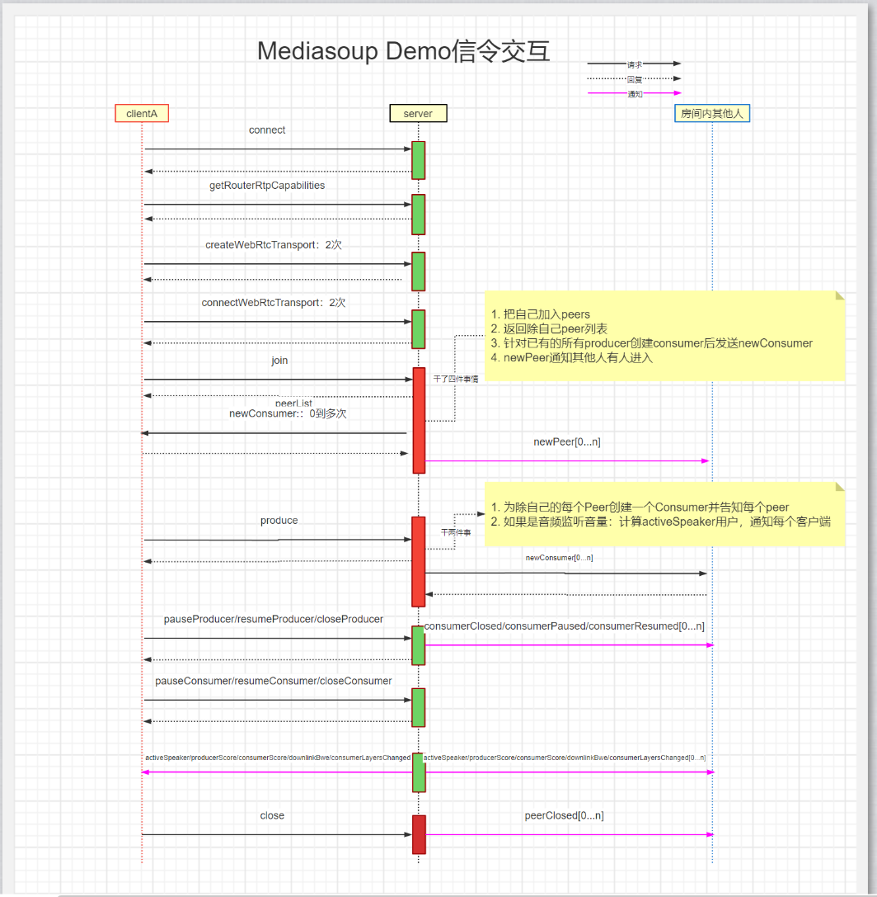
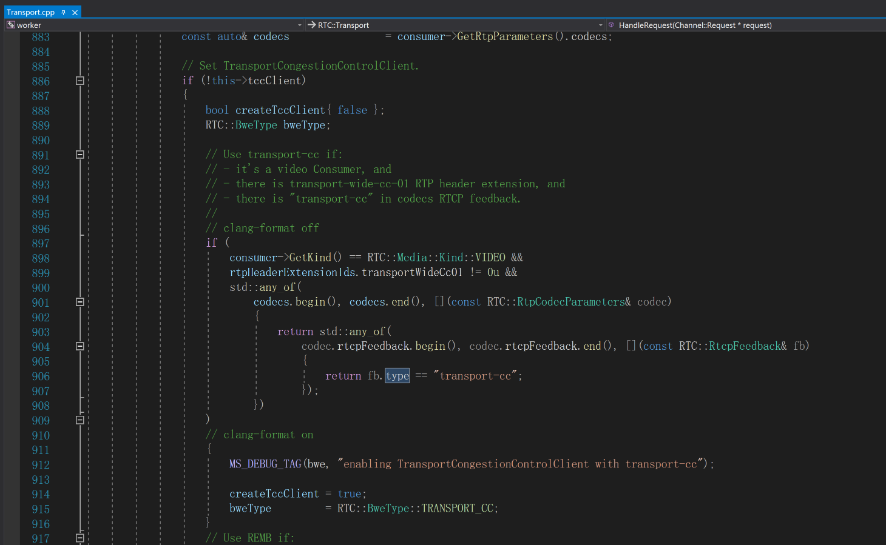
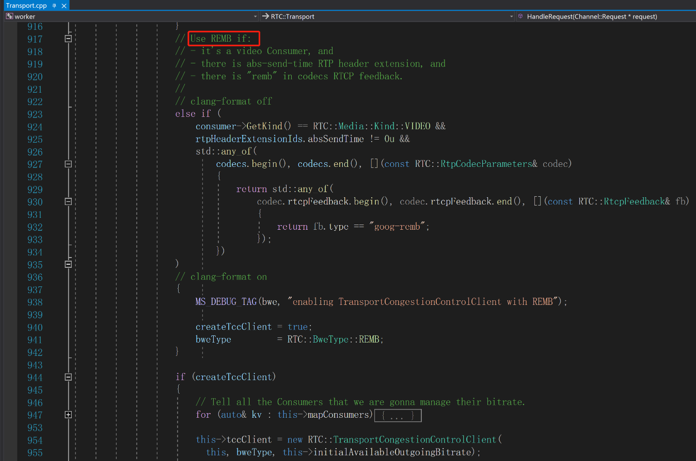

# demo信令：
信令交互图

1. getRouterRtpCapabilities：获取rtp支持特性。
2. join：从已经加入的成员那里创建Consumer会给客户端发newConsumer，并给他们发newPeer。
3. createWebRtcTransport：在服务端创建transport。
```
{
    "response":true,
    "id":1354770,
    "ok":true,
    "data":{
        "id":"4ab8ada9-5302-4afb-a8c4-3b33ba182852",
        "iceParameters":{
            "iceLite":true,
            "password":"9in2qytjy1r0mkq1a78vvnicnik5v13i",
            "usernameFragment":"zot8o0flwfpige87"
        },
        "iceCandidates":[
            {
                "foundation":"udpcandidate",
                "ip":"192.168.0.4",
                "port":44537,
                "priority":1076302079,
                "protocol":"udp",
                "type":"host"
            }
        ],
        "dtlsParameters":{
            "fingerprints":[
                {
                    "algorithm":"sha-1",
                    "value":"74:7C:06:EF:9A:9B:C5:99:71:7D:EB:0F:B7:DE:F9:78:11:66:BD:69"
                },
                {
                    "algorithm":"sha-224",
                    "value":"15:5F:0C:07:3B:C1:CD:48:34:7A:4C:13:BE:9A:ED:81:46:1F:AB:8D:36:F9:64:38:C7:4D:8B:4A"
                },
                {
                    "algorithm":"sha-256",
                    "value":"8E:E5:42:89:EC:A9:E2:58:B8:BD:1B:48:4F:30:DC:BD:74:7E:83:FD:60:CD:A4:47:C4:83:5D:DB:DF:3B:27:4A"
                },
                {
                    "algorithm":"sha-384",
                    "value":"AE:AE:0A:0D:39:F5:BD:CD:A2:07:24:D5:F5:7C:11:EE:46:F8:12:8E:22:D8:8C:0F:26:07:A5:73:4E:31:08:F8:60:7C:B6:F5:7F:62:4A:66:AF:6B:E1:5D:D2:1D:E1:71"
                },
                {
                    "algorithm":"sha-512",
                    "value":"32:2B:41:16:B7:3B:C6:23:35:59:14:F8:C1:50:2D:57:D9:7B:F7:4C:61:AB:CF:6E:5B:6D:31:0A:EE:A7:98:52:0D:E4:DB:2F:0D:5B:4A:81:BB:93:27:B6:D7:BF:47:5D:4B:94:65:AB:62:AB:66:A3:28:38:80:8C:2F:D5:BB:F3"
                }
            ],
            "role":"auto"
        }
    }
}
```
4. connectWebRtcTransport：客户端创建通道后向服务端提供dtlsParameters，才能连接。
```
{
    "data":{
        "dtlsParameters":{
            "fingerprints":[
                {
                    "algorithm":"sha-256",
                    "value":"44:BC:3C:2D:19:A9:EF:0D:27:C4:BC:59:93:9E:E6:59:15:0E:43:34:7F:92:BD:4F:DB:EB:A2:76:0D:43:F7:D3"
                }
            ],
            "role":"server"
        },
        "transportId":"4ab8ada9-5302-4afb-a8c4-3b33ba182852"
    },
    "id":1354770,
    "method":"connectWebRtcTransport",
    "request":true
}
```
5. restartIce：重启ice连接。
6. produce/closeProducer/pauseProducer/resumeProducer：创建/删除/暂停/恢复音视频生产者，要通知房间里其他的所有人。
```
{
    "data":{
        "appData":{

        },
        "kind":"video",
        "rtpParameters":{
            "codecs":[
                {
                    "clockRate":90000,
                    "mimeType":"video/VP8",
                    "parameters":{

                    },
                    "payloadType":96,
                    "rtcpFeedback":[
                        {
                            "parameter":"",
                            "type":"goog-remb"
                        },
                        {
                            "parameter":"",
                            "type":"transport-cc"
                        },
                        {
                            "parameter":"fir",
                            "type":"ccm"
                        },
                        {
                            "parameter":"",
                            "type":"nack"
                        },
                        {
                            "parameter":"pli",
                            "type":"nack"
                        }
                    ]
                },
                {
                    "clockRate":90000,
                    "mimeType":"video/rtx",
                    "parameters":{
                        "apt":96
                    },
                    "payloadType":97,
                    "rtcpFeedback":[

                    ]
                }
            ],
            "encodings":[
                {
                    "dtx":false,
                    "rtx":{
                        "ssrc":2196894209
                    },
                    "ssrc":106197398
                }
            ],
            "headerExtensions":[
                {
                    "encrypt":false,
                    "id":4,
                    "parameters":{

                    },
                    "uri":"urn:ietf:params:rtp-hdrext:sdes:mid"
                },
                {
                    "encrypt":false,
                    "id":5,
                    "parameters":{

                    },
                    "uri":"urn:ietf:params:rtp-hdrext:sdes:rtp-stream-id"
                },
                {
                    "encrypt":false,
                    "id":6,
                    "parameters":{

                    },
                    "uri":"urn:ietf:params:rtp-hdrext:sdes:repaired-rtp-stream-id"
                },
                {
                    "encrypt":false,
                    "id":2,
                    "parameters":{

                    },
                    "uri":"http://www.webrtc.org/experiments/rtp-hdrext/abs-send-time"
                },
                {
                    "encrypt":false,
                    "id":3,
                    "parameters":{

                    },
                    "uri":"http://www.ietf.org/id/draft-holmer-rmcat-transport-wide-cc-extensions-01"
                },
                {
                    "encrypt":false,
                    "id":13,
                    "parameters":{

                    },
                    "uri":"urn:3gpp:video-orientation"
                },
                {
                    "encrypt":false,
                    "id":14,
                    "parameters":{

                    },
                    "uri":"urn:ietf:params:rtp-hdrext:toffset"
                }
            ],
            "mid":"0",
            "rtcp":{
                "cname":"WhfBQa5YTn5Z4nHy",
                "reducedSize":true
            }
        },
        "transportId":"4ab8ada9-5302-4afb-a8c4-3b33ba182852"
    },
    "id":1354770,
    "method":"produce",
    "request":true
}
```
7. pauseConsumer/resumeConsumer：暂停/恢复音视频消费者。
8. setConsumerPreferredLayers
9. setConsumerPriority
10. requestConsumerKeyFrame
11. produceData：要通知房间里其他的所有人。
12. changeDisplayName：不用经过worker，通知其他人。
### 统计接口：
1. getTransportStats
1. getProducerStats
1. getConsumerStats
1. getDataProducerStats
1. getDataConsumerStats
### 上传下载带宽限制接口：
1. applyNetworkThrottle/resetNetworkThrottle：开始和停止网络上传下载带宽限制，调用sitespeed.io/throttle模块。


### 带宽估计




