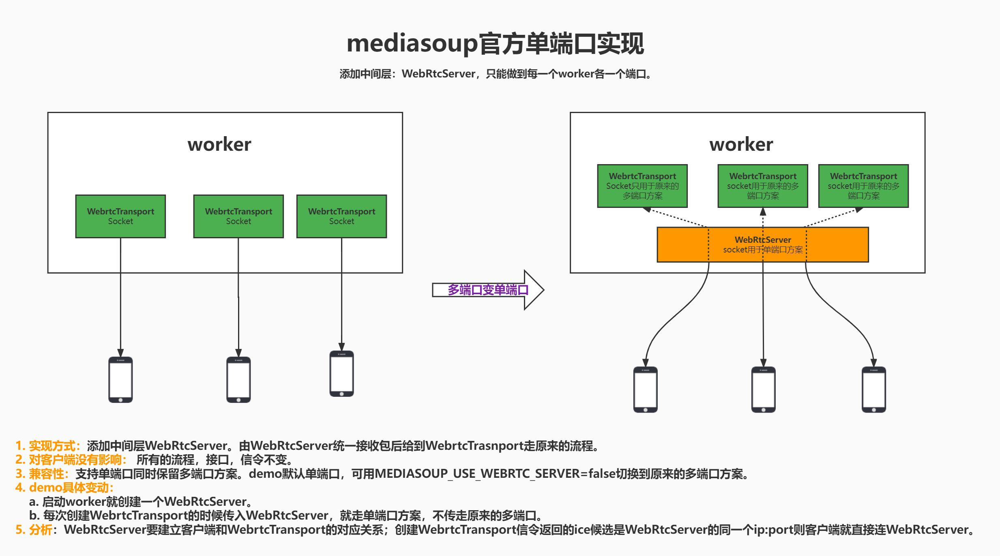

# mediasoup官方单端口实现
> 添加中间层：WebRtcServer，只能做到每一个worker各一个端口。
> 2022-6-22发布的版本：3.10.0 

### 一. 单端口实现
1. 实现方式：通过添加中间层WebRtcServer实现。由WebRtcServer统一接收包后给到WebrtcTrasnport走原来的流程。
2. 对客户端没有影响： 所有的流程，接口，信令不变。
3. 兼容性：支持单端口同时保留多端口方案。demo默认单端口，可用MEDIASOUP_USE_WEBRTC_SERVER=false切换到原来的多端口方案。
4. demo具体变动：
    - 启动worker就创建一个WebRtcServer。
    - 每次创建WebrtcTransport的时候传入WebRtcServer，就走单端口方案，不传走原来的多端口。
5. 分析：
    - WebRtcServer要建立客户端和WebrtcTransport的对应关系；
    - 创建WebrtcTransport信令返回的ice候选是WebRtcServer的同一个ip:port则客户端就直接连WebRtcServer。
6. 相关文档地址
    - [mediasoup3.10.0版本发布说明](https://mediasoup.discourse.group/t/mediasoup-3-10-0-released-with-the-new-webrtcserver-class-listen-into-a-single-port/4313)
    - [mediasoup的代码变更](https://github.com/versatica/mediasoup/commit/5c858603cd7113e094001770be8ec8b8836f9cbb)
    - [mediasoup-demo的代码变更](https://github.com/versatica/mediasoup-demo/commit/c3610f3edd9cab732f778cfe9c1388fa9c024101)
    - [mediasoup的API文档变化-worker-createWebRtcServer](https://mediasoup.org/documentation/v3/mediasoup/api/#worker-createWebRtcServer)
    - [mediasoup的API文档变化-WebRtcServer](https://mediasoup.org/documentation/v3/mediasoup/api/#WebRtcServer)
7. 一张图总结

### 二. 单端口socket扩展知识
1. 关于单端口，这里面有3个问题： https://mp.weixin.qq.com/s/IAmJAZ3HA0_FIX0-lannZw
    - tcp和udp可以用同一端口吗？ 可以
    - 两个tcp可以吗？ 可以，需要reuse。 nginx就是那样的。 但可能出现惊群现象。
    - 两个upd可以吗？没测试，但reuse模式应该可以，但只有一个进程能收到包。
    - mediasoup createWebRtcTransport的时候 要先告诉服务端用tcp还是udp
2. [Linux下端口复用(SO_REUSEADDR与SO_REUSEPORT)](http://t.zoukankan.com/hehehaha-p-6332326.html)
3. freebsd与linux下bind系统调用小结：只考虑AF_INET的情况（同一端口指ip地址与端口号都相同）
    - freebsd支持SO_REUSEPORT和SO_REUSEADDR选项,而linux只支持SO_REUSEADDR选项。
    - freebsd下,使用SO_REUSEPORT选项，两个tcp的socket可以绑定同一个端口；同样，使用SO_REUSEPORT选项，两个udp的socket可以绑定同一个端口。
    - linux下，两个tcp的socket不能绑定同一个端口；而如果使用SO_REUSEADDR选项，两个udp的socket可以绑定同一个端口。
    - freebsd下，两个tcp的socket绑定同一端口，只有第一个socket获得数据。
    - freebsd下，两个udp的socket绑定同一端口，如果数据包的目的地址是单播地址，则只有第一个socket获得数据，而如果数据包的目的地址是多播地址，则两个socket同时获得相同的数据。
    - linux下,两个udp的socket绑定同一端口，如果数据包的目的地址是单播地址，则只有最后一个socket获得数据，而如果数据包的目的地址是多播地址，则两个socket同时获得相同的数据。
