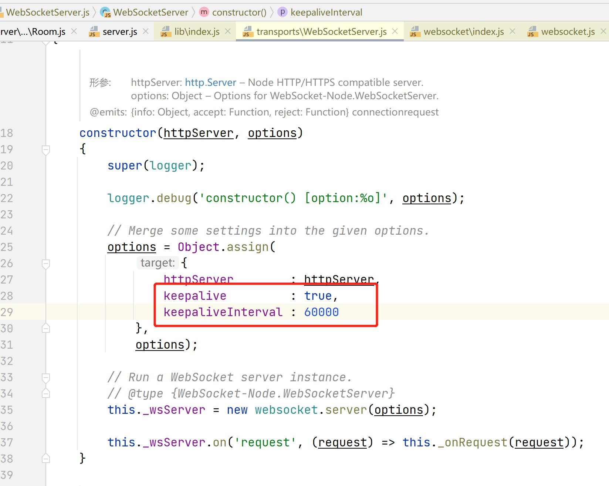
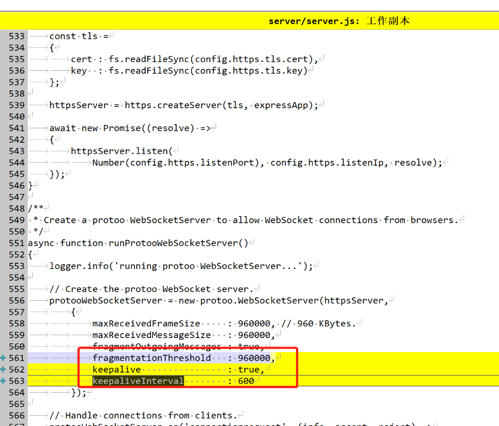

# mediasoup的demo的websocket的keepalive与断网检测

### 1. 心跳必须是双向的，断网后才能serve，client各自检测到
- 服务端发ping成功与否判断连接peer是否断开
- 客户端也需要发ping，判断客户端自己是否断开

### 2. mediassoup的websocket server怎么检查客户端掉线
- websocket收到ping都会回复pong，一般websocket实现库内部就会实现
- protoo-sever会定期的ping client，默认ping-pong检查是60秒。所以意外断网可能要多等一会儿，但是可以修改配置。

- 改成600毫秒

### 3. 客户端心跳做法
websocket两端判断网络可用性都需要加心跳检测，两种做法：推荐第一种，websocket自带的方式
- 用websocket自带的ping-pong，不断的发ping。根据发送情况和返回pong的时间检测网络。
- 在业务层添加自定义信令如"heartbeat"实现。

