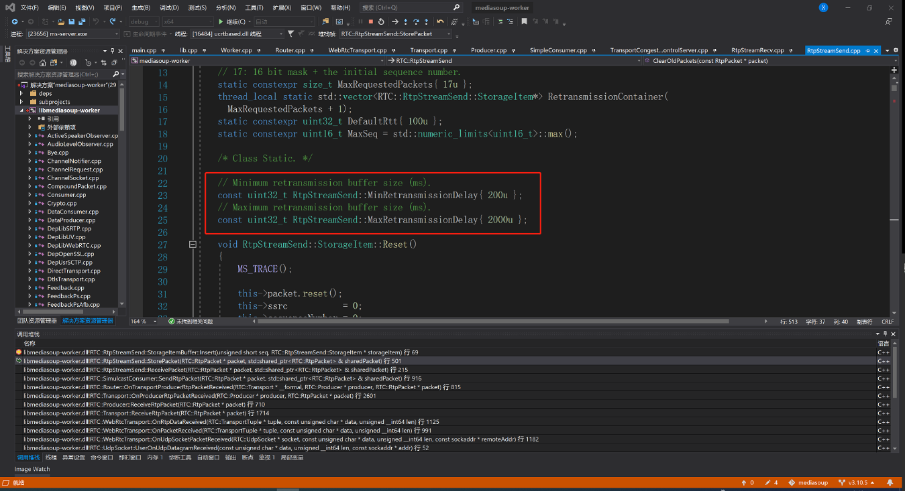
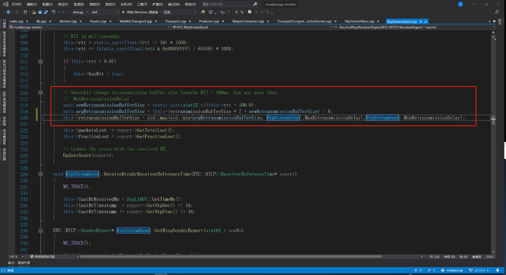
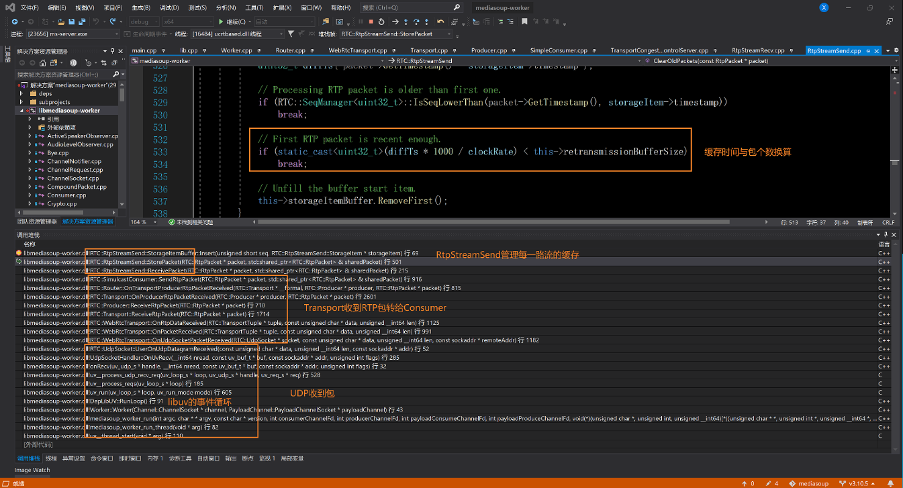

# mediasoup的包缓存

### 一. 直接上图
1. 缓存最近200-2000毫秒内的包，同时根据RTT(毫秒)动态平滑调整:
    ```新的包缓存时间 = （原来包缓存时间 * 7 + rtt + 100.0）/8```


2. 看看调用堆栈


### 二. 简单分析下
1. 跟一些rtmp服务器缓存一个gop的做法不同，这个缓存只是用来做nack的。
2. 每个一路流独立一个缓存.
3. 缓存只用作nack说明：它应该不太会影响延迟。
4. 没有缓存gop说明：客户端刚连上来可能会花屏，应该发关键帧请求。 当然这些webrtc库内部都会自动处理。
5. 最大缓存2秒， 假设就2M，1000路适配就需要2G缓存空间：这说明高并发的时候，内存可能会吃紧。