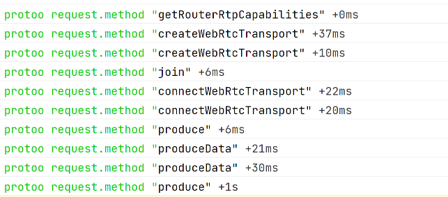

## Protoo的使用与实现
> wss://123.57.87.177:4443/?roomId=1&peerId=rscbbke

1. Protoo协议：https://protoo.versatica.com/
    - 实现了基于json的传输协议。
    - 但没有实现网络传输transport，需要用户按照接口实现网络传输，可以用websocket或tcp，甚至dup实现。
    - 消息分三类：
        - Request(request，id，method，data)
            - 请求消息，回调给用户处理并需要回复：accept或reject。
        - Response(response，id，ok，data/errorCode/errorReason)
            - 回复消息，发包结果需要回调给用户：resolve或reject。
        - Notification(notification，method，data)
            - 通知消息，需要回调给用户。
    - 初始化传入transport和监控listener。request函数发包和收到Response都回调给用户。
2. 官方js版本protoo-client的实现用法

   1. 内部封装了WebSocket传输通道和Peer(ws客户端);
   2. WebSocketTransport自动重连。
   3. WebSocketTransport给Peer处理业务。
   
    ```
    const protooTransport = new protooClient.WebSocketTransport(this._protooUrl);
    this._protoo = new protooClient.Peer(protooTransport);
    this._protoo.on('open', () => {}});
    this._protoo.on('failed', () => {});
    this._protoo.on('disconnected', () =>{});
    this._protoo.on('close', () => {});
    this._protoo.on('request', async (request, accept, reject) =>{});
    this._protoo.on('notification', (notification) =>{});
    ```
3. 官方js版本protoo-server的实现用法

   1. 内部封装了WebSocketServer，WebSocket传输通道，Room, Peer(ws客户端);
   2. WebSocketServer通过connectionrequest事件处理连接请求，accept获取WebSocketTransport。
   3. WebSocketTransport给Room集中管理Peer处理业务。
   4. 断开后等客户端重连。
   
    ```
   //创建WebSocketServer，需要提前创建httpServer
    protooWebSocketServer = new protoo.WebSocketServer(httpsServer,
    {
        maxReceivedFrameSize     : 960000, // 960 KBytes.
        maxReceivedMessageSize   : 960000,
        fragmentOutgoingMessages : true,
        fragmentationThreshold   : 960000
    });
   
   //处理连接请求
    protooWebSocketServer.on('connectionrequest', (info, accept, reject) =>
    {
        //接收连接
        const protooWebSocketTransport = accept();
        //或者拒绝连接
        //reject(error);
        
        //通过房间创建peer，监听消息。
        peer = this._protooRoom.createPeer(peerId, protooWebSocketTransport);
        peer.on('request', (request, accept, reject) =>{});
        peer.on('close', () =>{});
    }
    ```
4. demo的客户端请求协议
