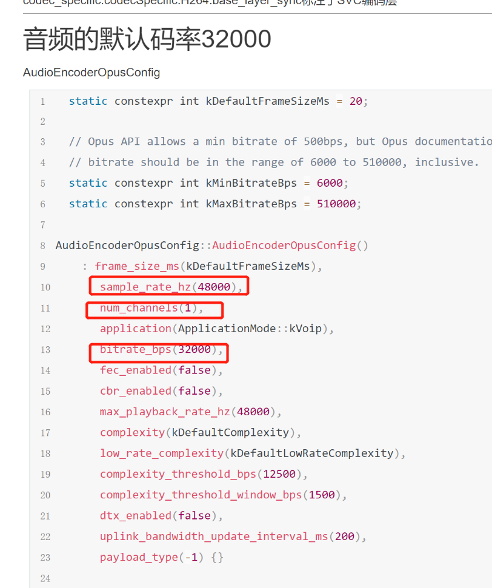
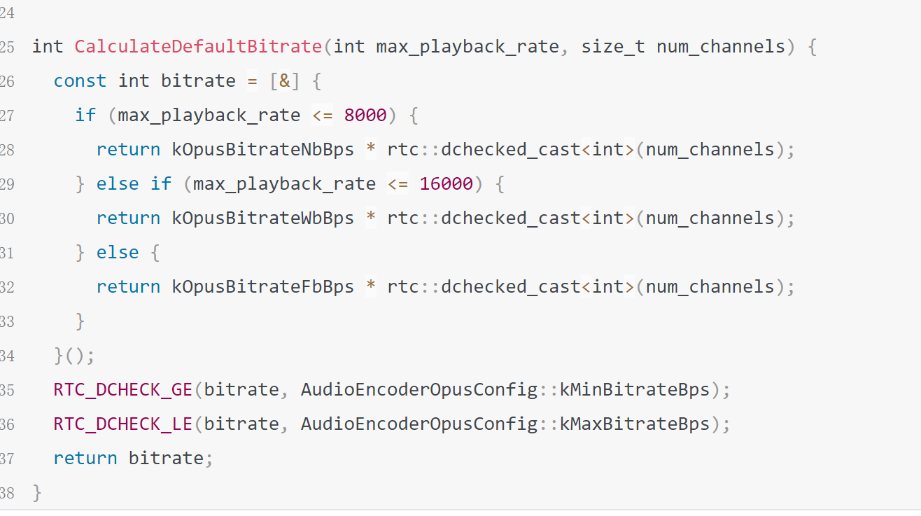

# webrtc和mediasoup音视频码率大小

### 一. 音频的码率设置
1. webrtc的音频码率设置，采样率---->码率 对应关系是：
    - 8k --- 12k  x 通道数， 
    - 16k ----20k x 通道数
    - 32或者48k ----->32k x 通道数

2. 具体见下面的代码：



```
constexpr int kOpusBitrateWbBps = 20000
// Codec parameters for Opus.
// draft-spittka-payload-rtp-opus-03

// Recommended bitrates:
// 8-12 kb/s for NB speech,
// 16-20 kb/s for WB speech,
// 28-40 kb/s for FB speech,
// 48-64 kb/s for FB mono music, and
// 64-128 kb/s for FB stereo music.
// The current implementation applies the following values to mono signals,
// and multiplies them by 2 for stereo.
constexpr int kOpusBitrateNbBps = 12000;
constexpr int kOpusBitrateWbBps = 20000;
constexpr int kOpusBitrateFbBps = 32000;

constexpr int kRtpTimestampRateHz = 48000;
constexpr int kDefaultMaxPlaybackRate = 48000;
```

### 二. 视频的码率设置
TODO
### 三. mediasop的码率设置
TODO
