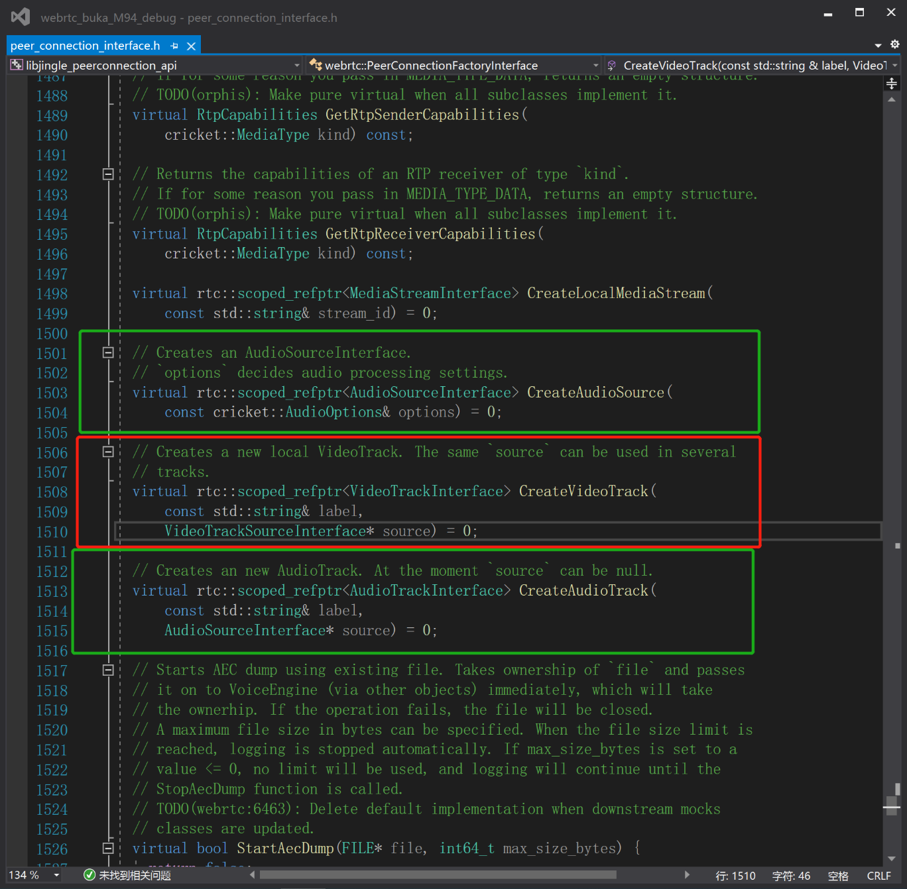
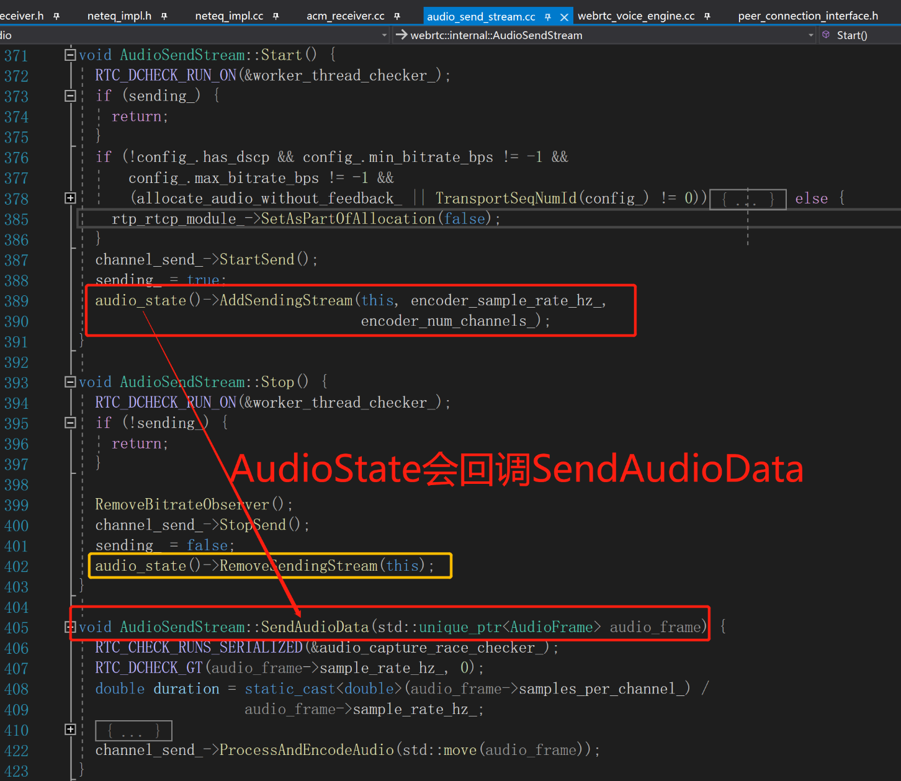
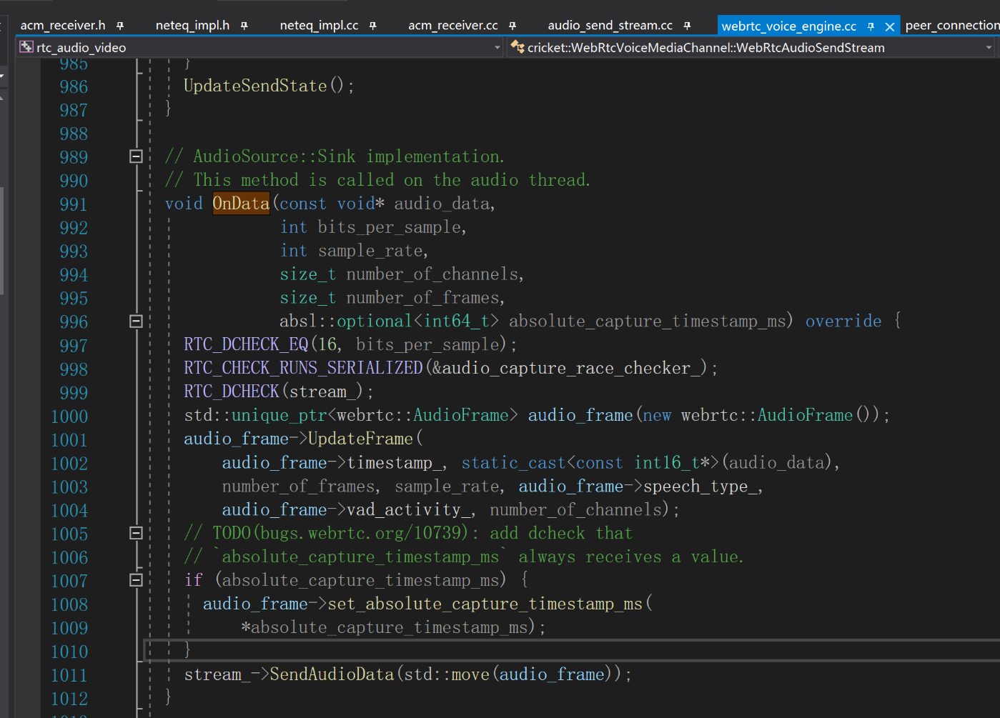
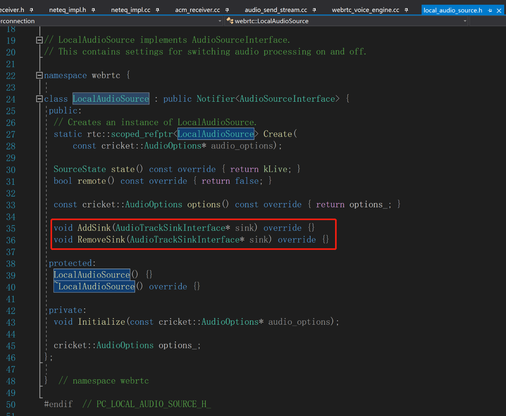

# webrtc同时推多路音频流的方案调研

### 一. 问题引出
1. 屏幕共享的时候怎么同时推送系统音频流 和 麦克风音频流？
2. 方案一：能不能像视频那也创建audiosource+audiotrack？
3. 方案二：如果方案一不行，是不是要混音成一路？
4. 这都跟webrtc内部音频的采集推流流程相关，会涉及到AudioState

### 二. 先看结论
1. 音频推流：默认会直接从**全局的音频采集模块adm**取音频数据来发送。
2. 音频推流：默认也会接收AudioSource通过OnData回调的音频数据来发送。
3. 两个数据会不会冲突：webrtc自己的LocalAudioSource没有产生数据，所以不会。
4. **如果自己实现了AudioSource音频数据，需要丢掉从adm获取的数据！！！**
5. 如果要混音的方案就重载adm。
结论：方案1要改webrtc源码，方案二要自定义adm且只有一路流。

### 三. 分析代码
1. PeerConnectionFactory对视频只提供CreateVideoTrack接口 + 没有CreateVideoSource
2. PeerConnectionFactory对视频提供了CreateAudioTrack接口 + CreateAudioSource接口。

3. 音频发送数据来自AudioState，也就是adm音频采集和播放模块。

4. 同时，音频发送数据也来自AudioSource。

5. webrtc自己的LocalAudioSource没有产生数据，所以不会冲突
