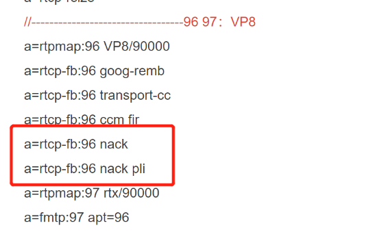
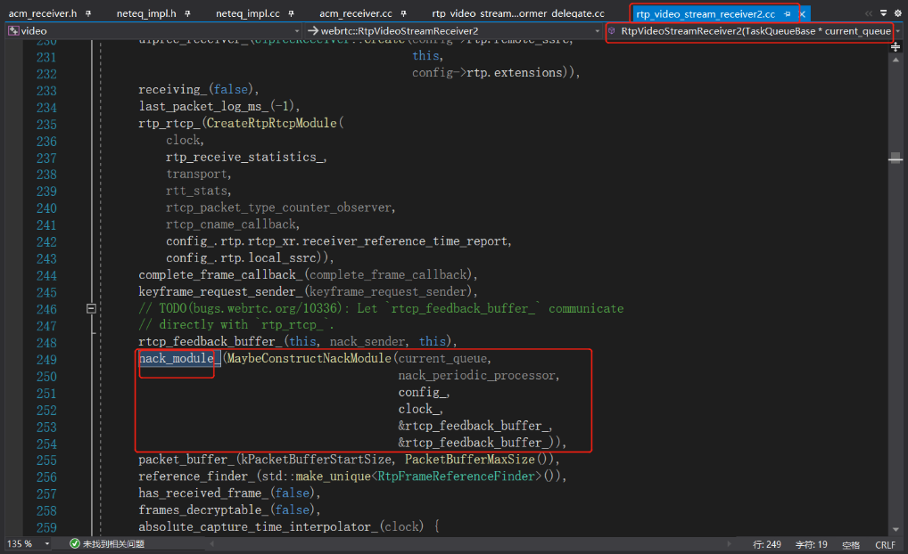
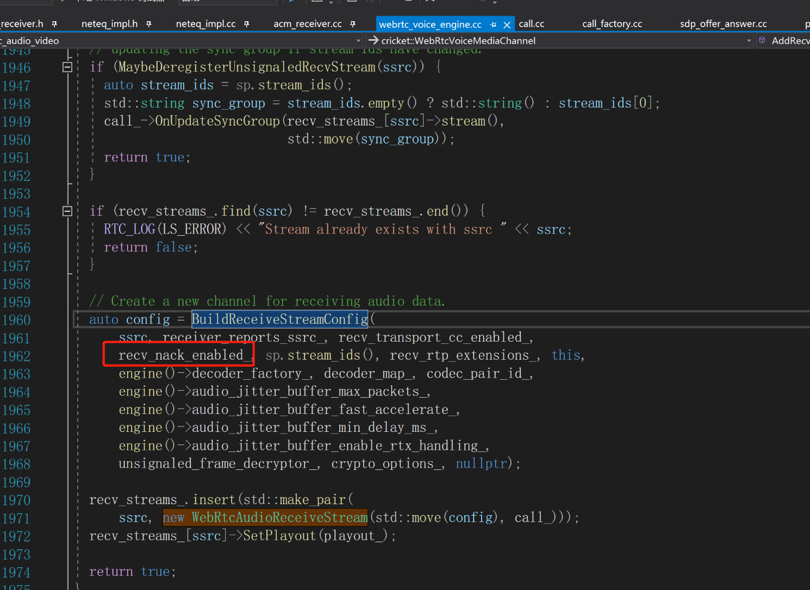
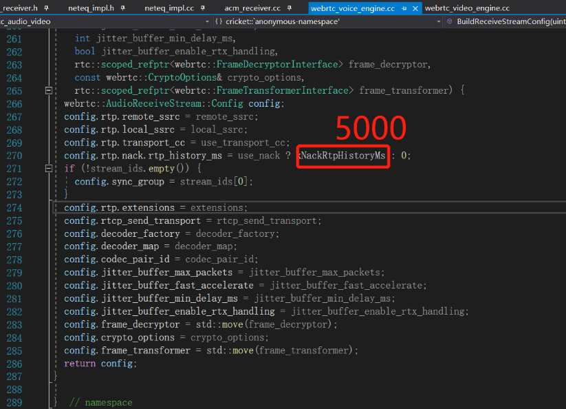
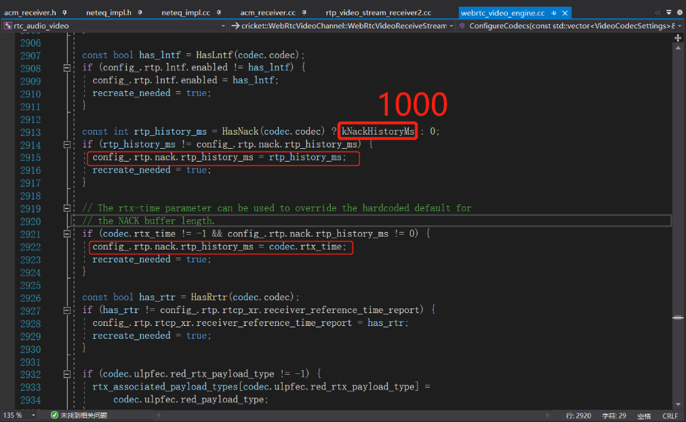

# webrtc的nack

### 一. 结论

类型 | 默认状态 | 怎么开关 | 处理模块 | 默认nack历史时长
---|---|---|---|---
音频 | **不开启** | 用sdp开关 | AudioReceiveStream下neteq分析和发起 | 5秒不可改
视频 | 开启       | 用sdp开关 | RtpVideoStreamReceiver2的nack_module_分析和发起 |1秒，且可用sdp改

### 二. 上图
1. sdp里面可以指定nack开关，视频sdp甚至nack历史包时间

2. 音频neteq维护一个nacklist，在收到音频包的时候获取neteq的nacklist，进而发送rtcp的nack请求

3. 视频的nack管理


### 三. 关于nack控制参数的传递
1. 音频：recv_nack_enabled_来自sdp，音频nack历史包时间固定5秒，不可调节
```config.rtp.nack.rtp_history_ms = use_nack ? kNackRtpHistoryMs : 0;```


2. 视频：rtp_history_ms来自sdp，视频nack历史包时间固定1秒，可以根据sdp修改。


