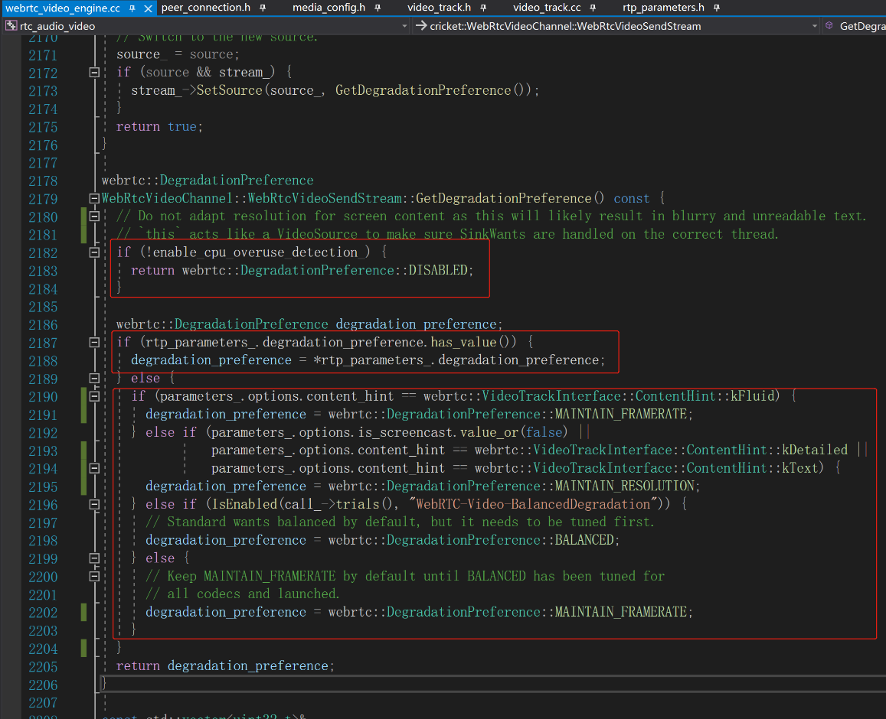
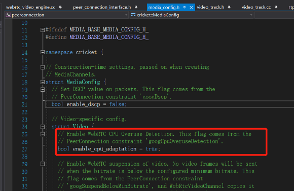

# webrtc的视频的过载保护机制
> 当系统资源不够用的时候，webrtc是怎么处理视频的呢？ 是丢帧呢还是降分辨率？

下面的代码参考webrtcM94的代码

### 一．先上结论
|四种处理机制|说明|特点|适用情况|代码|
|----|----|----|----|----|
|DISABLED               |关闭             |不做处理             |相当于全局开关，默认开启|
|MAINTAIN_FRAMERATE(默认)|保持帧率，降低分辨率|保证流畅性，降低清晰度|用户设置track的content_hint=kFluid，要求保证流畅性|videotrack->set_content_hint(kFluid)|
|MAINTAIN_RESOLUTION    |保持分辨率，降低帧率|保证清晰度，降低流畅性|用户设置track的content_hint=kDetailed或kText，要求保证清晰度；屏幕录制流|videotrack->set_content_hint(kDetailed)|
|BALANCED               |在帧率和分辨率之间保持一个平衡|流畅性和清晰度的平衡|用户设置了WebRTC-Video-BalancedDegradation|

### 二. webrtc提供了DegradationPreference，4种降级处理机制。
1. DISABLED：关闭，不做处理。
2. MAINTAIN_FRAMERATE：保持帧率，降低分辨率。 保证了流畅性。
3. MAINTAIN_RESOLUTION：保持分辨率，降低帧率。 保证了清晰度。
4. BALANCED：在帧率和分辨率之间保持一个平衡。 在流畅性和清晰度做平衡。


### 三. webrtc的处理逻辑
1. 如果关闭了【cpu过载检测】就是DISABLED。
2. 如果在rtp_parameters_里设置了DegradationPreference就直接使用。
3. 否认在根据content_hint来判断：
    1. 如果是kFluid，就使用MAINTAIN_FRAMERATE保持帧率
    2. 如果是屏幕录制流或者kDetailed或者kText，就使用MAINTAIN_RESOLUTION保持分辨率。
4. 如果设置了WebRTC-Video-BalancedDegradation就使用BALANCED。
5. 最后默认MAINTAIN_FRAMERATE


### 四. 用户怎么用参数控制呢？
1. web前端用户去查文档https://w3c.github.io/webrtc-pc/#idl-def-rtcdegradationpreference
    - 下面的web api变化来自霍大大
    ```
    因为对视频降级有需求，一直以对块比较关注。
    最早是关闭CPU探测的一个私有方法googCpuOveruseDetection。来防止视频降级。
    春节前一段时间，chrome在悄悄的删除这个方法了。
    
    去翻代码，发现他实现了track.contentHints，来指定降级方式。
    ```
2. 【cpu过载检测】默认是开启的。
`PeerConnectionInterface::RTCConfiguration::MediaConfig::enable_cpu_adaptation =  true`

3. 设置VideoTrack的content_hint：


### 五. mediasoup用户
过载保护行为是纯粹的客户端行为，mediasoup没有参与控制。