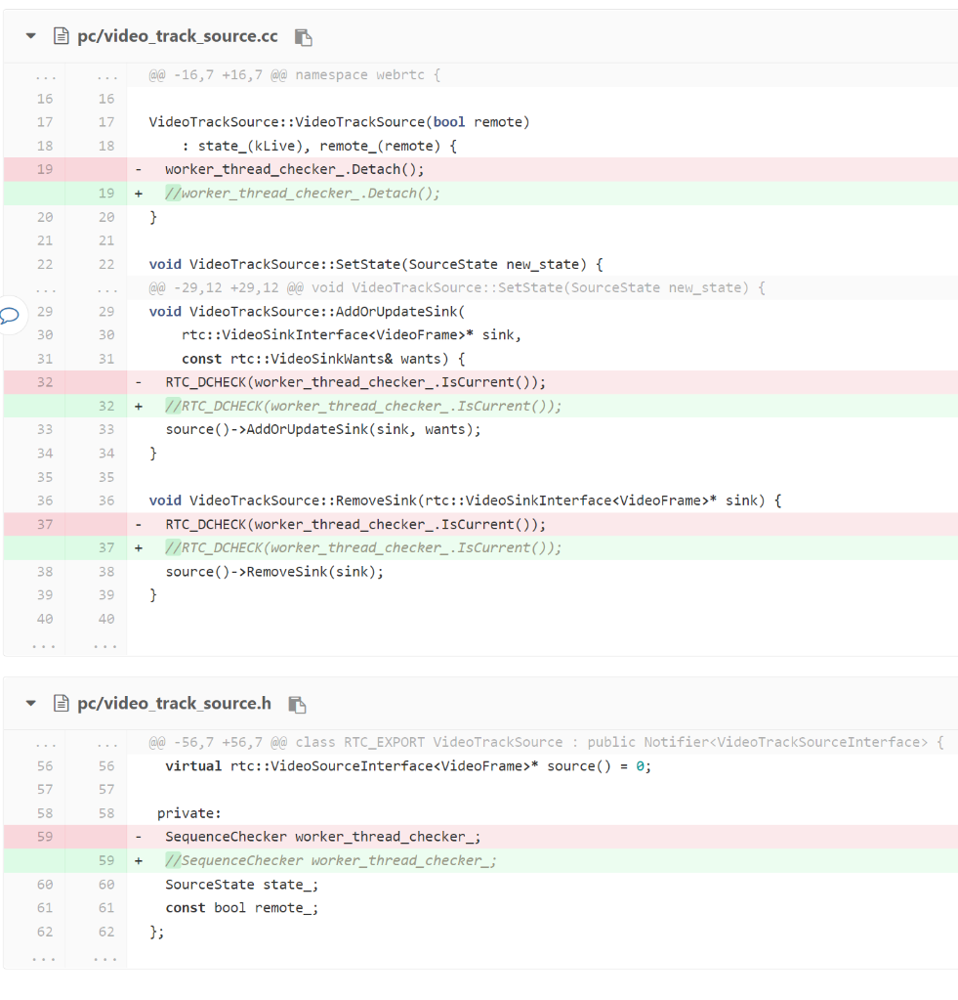

# webrtc解决bug：Mac下MutexImpl析构崩溃

### 一. 问题
- VideoTrackSource在析构的时候，成员SequenceChecker worker_thread_checker_析构时在内部的MutexImpl析构崩溃。
- 具体在：~MutexImpl() { pthread_mutex_destroy(&mutex_); }
- 原因：简单分析后不得而知！！！

### 二. 解决方法
- 删掉不用 ：worker_thread_checker_只是做线程的检查，完全可以不用

### 三. 修改代码
- 修改：pc/video_track_source.h和video_track_source.cc
