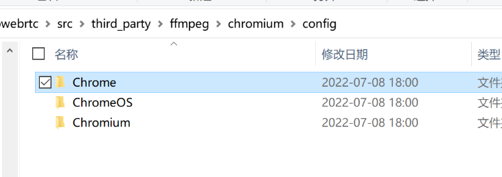
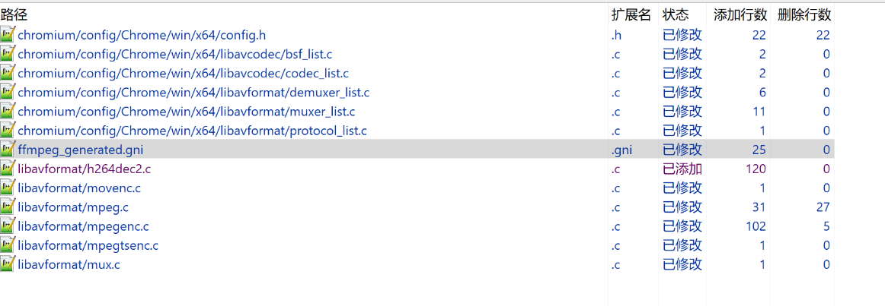

# webrtc集成ffmpeg的方法
> webrtc内置了ffmpeg，但组件不全；要定制ffmpeg有两种方法

#### 一. 两种方法
1. 通过定制webrtc内部ffmpeg的配置使用ffmpeg更多功能。 ---不推荐 
2. 用libwebrtc+外置的ffmpeg。---推荐

### 二. 通过定制webrtc内部ffmpeg的配置使用ffmpeg更多功能
1. google有三个产品使用了ffmpeg，每个使用的配置都是独立的

2. 增加组件可能要改四个地方：
    - gn gen args要指定使用的产品类型：ffmpeg_branding=\"Chrome\"
    - 要改webrtc源码下：third_party/ffmpeg/chromium/os/cpuarch/config.h 开启相关配置开关。
    - third_party/ffmpeg/chromium/os/cpuarch/组件名/组件列表.c：增加组件
    - 修改third_party/ffmpeg/ffmpeg_generated.gni 加入要编译的文件

